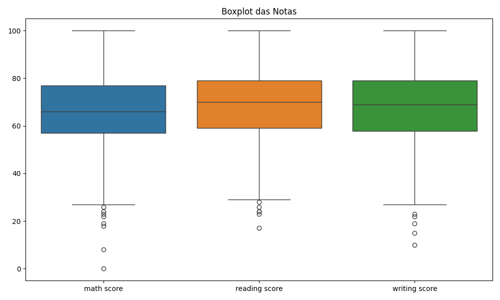

# 3. Análise Exploratória dos Dados

Verificamos o formato do dataset, os tipos de dados e se há valores nulos. Isso garante a qualidade dos dados antes da análise.

**🟢 Resultado**

- Formato do dataset: (1000, 8)
- Não há valores nulos nas colunas.
- Estatísticas das notas:

|        | math score | reading score | writing score |
|--------|------------|--------------|--------------|
| count  | 1000.00    | 1000.00      | 1000.00      |
| mean   | 66.09      | 69.17        | 68.05        |
| std    | 15.16      | 14.60        | 15.19        |
| min    | 0.00       | 17.00        | 10.00        |
| 25%    | 57.00      | 59.00        | 57.75        |
| 50%    | 66.00      | 70.00        | 69.00        |
| 75%    | 77.00      | 79.00        | 79.00        |
| max    | 100.00     | 100.00       | 100.00       |

> 💡 Não há valores nulos e as notas apresentam distribuição próxima do normal.

---
**🟢 Gráfico de Dispersão (Pairplot)**

---
**🟢 Histogramas das Notas**

---
**🟢 Boxplot das Notas**

---
**🟠 Observação**

> O atributo `passed` foi utilizado apenas para visualização, pois o K-means é um método não supervisionado e não utiliza rótulos para agrupar os dados.