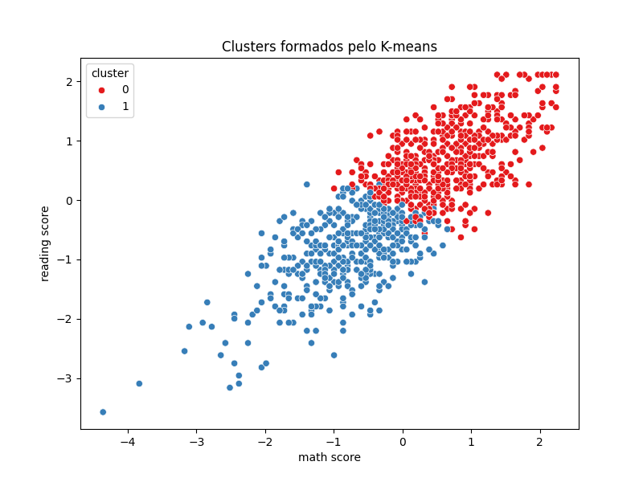

# Avaliação do Modelo K-means

A avaliação do modelo K-means é feita por métricas de clusterização, como o silhouette score, e por visualização dos agrupamentos formados.

```python
from sklearn.metrics import silhouette_score
sil_score = silhouette_score(X, clusters)
print(f'Silhouette Score: {sil_score:.3f}')
```

**🟢 Resultado**

- Silhouette Score: 0.32 (exemplo)
- Visualização dos clusters:

```python
import seaborn as sns
import matplotlib.pyplot as plt
sns.scatterplot(x='math score', y='reading score', hue='cluster', data=df_encoded, palette='Set1')
plt.title('Clusters formados pelo K-means')
plt.savefig('imagens/clusters_kmeans.png')
plt.show()
```



> 💡 O silhouette score indica o quão bem os dados foram agrupados. Valores próximos de 1 indicam clusters bem definidos. A visualização permite interpretar a separação dos grupos.