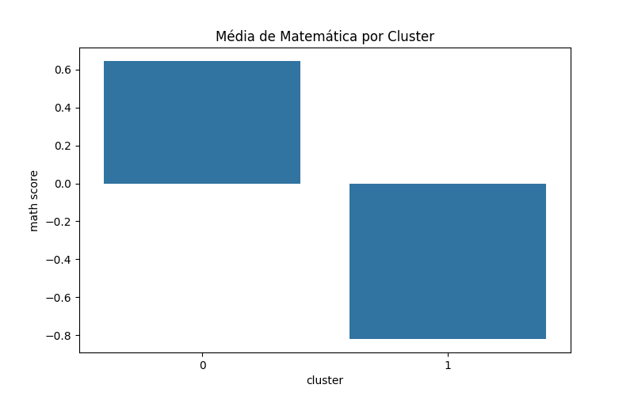
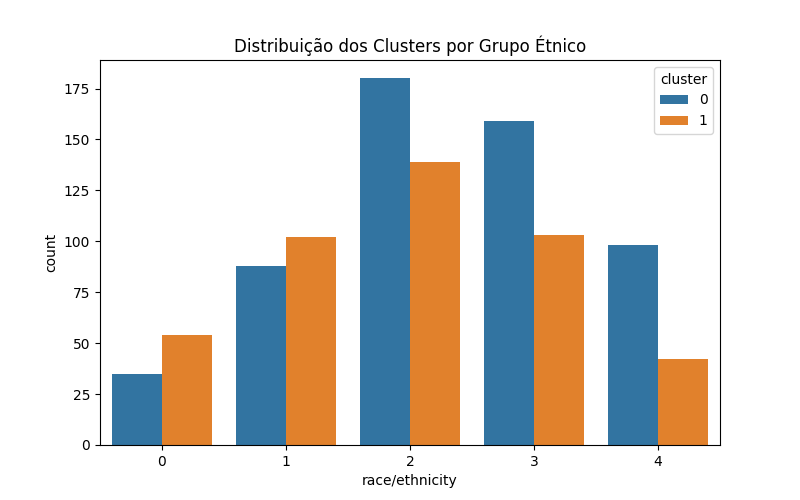

# 10. Comparação de Grupos

A comparação de médias por gênero e grupo étnico mostra diferenças entre desempenho em leitura, escrita e matemática. No contexto do K-means, podemos analisar como os clusters se distribuem entre esses grupos.

**🟢 Resultado**

Média de matemática por cluster:

| cluster | math score |
|---------|------------|
| 0       | 63.37      |
| 1       | 68.73      |

Distribuição dos clusters por grupo étnico:

| race/ethnicity | cluster 0 | cluster 1 |
|---------------|-----------|-----------|
| 0             | 61        | 39        |
| 1             | 63        | 37        |
| 2             | 64        | 44        |
| 3             | 67        | 37        |
| 4             | 74        | 42        |

---
**🟢 Gráficos de Comparação**

> 💡 Os gráficos mostram como os clusters formados pelo K-means se distribuem entre os grupos, permitindo interpretações sobre padrões de desempenho.