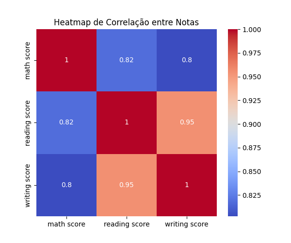

---
hide:
- toc
---

# 5. Correlação entre Variáveis


A análise de correlação é fundamental para entender como as variáveis numéricas se relacionam entre si. Correlações altas indicam que as variáveis carregam informações semelhantes, enquanto correlações baixas sugerem que cada variável pode contribuir de forma única para a classificação.

O heatmap facilita a visualização dessas relações, destacando pares de variáveis que se movem juntos ou de forma oposta. No contexto do KNN, entender as correlações ajuda a evitar redundância de informações e pode orientar a escolha de variáveis ou a necessidade de técnicas de redução de dimensionalidade.

=== "Código"
    ```python
    import matplotlib.pyplot as plt
    import seaborn as sns
    import os

    # Calcula a matriz de correlação entre as notas
    corr = df[['math score', 'reading score', 'writing score']].corr()

    # Cria o diretório de imagens se não existir
    os.makedirs('imagens', exist_ok=True)

    # Gera o heatmap
    plt.figure(figsize=(6,5))
    sns.heatmap(corr, annot=True, cmap='coolwarm')
    plt.title('Heatmap de Correlação entre Notas')
    plt.savefig('imagens/heatmap_correlacao_notas.png')
    plt.show()
    ```
=== "Resultado"
    
