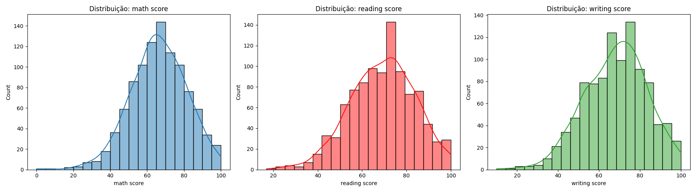
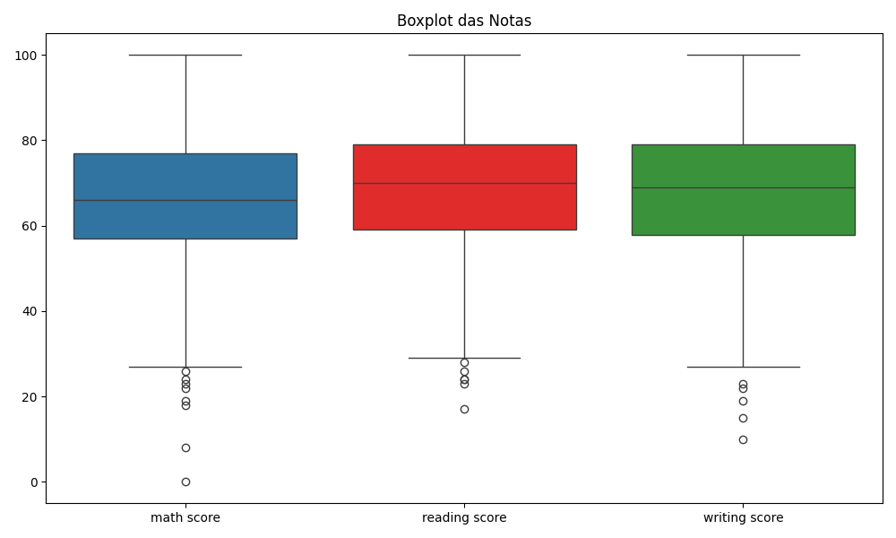

---
hide:
- toc
---

# Visualização das Notas


Visualizar a distribuição das notas é fundamental para identificar padrões, assimetrias, presença de outliers e diferenças entre as disciplinas. Histogramas mostram como as notas se distribuem (por exemplo, se há concentração em determinadas faixas ou caudas longas), enquanto boxplots facilitam a comparação entre as variáveis e destacam possíveis valores extremos.

Essas análises ajudam a entender a variabilidade do desempenho dos estudantes e fornecem subsídios para decisões sobre normalização, tratamento de outliers e seleção de variáveis para a classificação. Uma boa visualização pode revelar grupos naturais ou tendências que serão exploradas pelo KNN.

=== "Código"
    ```python
    import os
    from IPython.display import Image, display
    os.makedirs('imagens', exist_ok=True)

    fig, axes = plt.subplots(1, 3, figsize=(18, 5))
    for idx, col in enumerate(['math score', 'reading score', 'writing score']):
        sns.histplot(df[col], bins=20, ax=axes[idx], kde=True)
        axes[idx].set_title(f'Distribuição: {col}')
    plt.tight_layout()
    plt.savefig('imagens/histograma_notas.png')
    plt.show()
    display(Image(filename='imagens/histograma_notas.png'))

    plt.figure(figsize=(10, 6))
    sns.boxplot(data=df[['math score', 'reading score', 'writing score']])
    plt.title('Boxplot das Notas')
    plt.savefig('imagens/boxplot_notas.png')
    plt.show()
    display(Image(filename='imagens/boxplot_notas.png'))
    ```
=== "Resultado"
    Os histogramas mostram que as notas têm distribuição aproximadamente normal, com leve assimetria. O boxplot evidencia a presença de alguns outliers, principalmente nas notas mais baixas.
    
    


