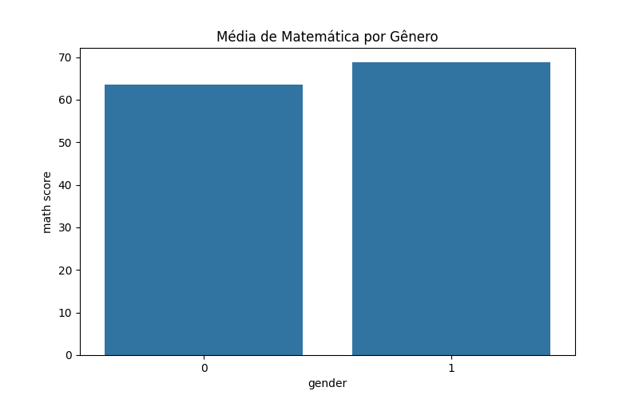
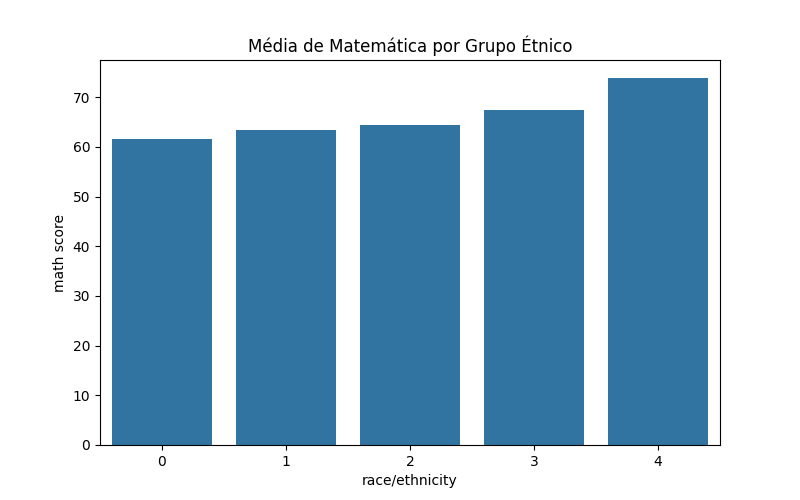

---
hide:
- toc
---

# 6. Comparação de Grupos

Nesta etapa, comparamos o desempenho dos estudantes por gênero e grupo étnico, utilizando gráficos de barras para visualizar as médias das notas.


=== "Código"
    ```python
    import matplotlib.pyplot as plt
    import seaborn as sns
    import os
    os.makedirs('imagens', exist_ok=True)

    fig, ax = plt.subplots(figsize=(8,5))
    sns.barplot(x='gender', y='math score', data=df, ci=None, ax=ax)
    plt.title('Média de Matemática por Gênero')
    plt.savefig('imagens/barplot_genero.png')
    plt.close()

    # Comparação por grupo étnico
    fig, ax = plt.subplots(figsize=(8,5))
    sns.barplot(x='race/ethnicity', y='math score', data=df, ci=None, ax=ax)
    plt.title('Média de Matemática por Grupo Étnico')
    plt.savefig('imagens/barplot_etnia.png')
    plt.close()
    ```
=== "Resultado"
    
    
