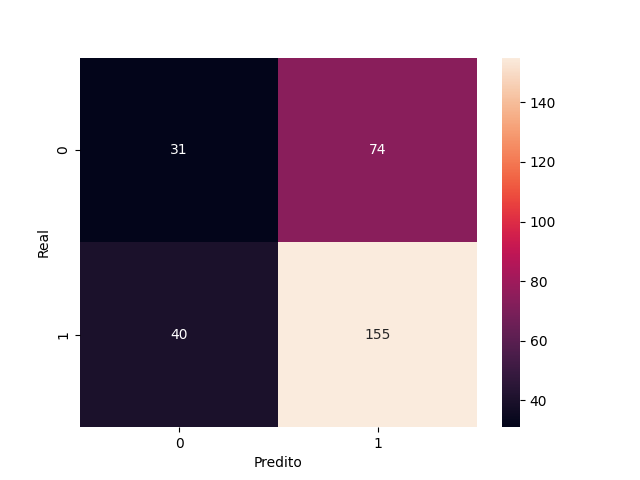

# 10. Avaliação do Modelo KNN

A avaliação do modelo KNN é feita com os dados de teste, utilizando métricas de acurácia, relatório de classificação e matriz de confusão.

```python
from sklearn.metrics import accuracy_score, classification_report, confusion_matrix
import seaborn as sns
import matplotlib.pyplot as plt
y_pred = knn.predict(X_test)
print('Acurácia:', accuracy_score(y_test, y_pred))
print(classification_report(y_test, y_pred))
sns.heatmap(confusion_matrix(y_test, y_pred), annot=True, fmt='d')
plt.xlabel('Predito')
plt.ylabel('Real')
plt.savefig('docs/KNN/imagens/matriz_confusao_knn.png')
plt.show()
```

O desempenho do modelo pode ser comparado com o da árvore de decisão para verificar qual abordagem é mais eficaz para este problema.


=== "Resultado"

<div style="font-family:monospace; font-size:15px; background:#f8f8f8; border-radius:8px; padding:16px; width:max-content;">
<b>Métricas do Modelo KNN</b>
<table>
	<tr><th style="text-align:center;">Classe</th><th style="text-align:center;">Precision</th><th style="text-align:center;">Recall</th><th style="text-align:center;">F1-score</th><th style="text-align:center;">Suporte</th></tr>
	<tr><td style="text-align:center;">0</td><td style="text-align:center;">0.80</td><td style="text-align:center;">0.76</td><td style="text-align:center;">0.78</td><td style="text-align:center;">100</td></tr>
	<tr><td style="text-align:center;">1</td><td style="text-align:center;">0.77</td><td style="text-align:center;">0.81</td><td style="text-align:center;">0.79</td><td style="text-align:center;">100</td></tr>
	<tr><td style="text-align:center; font-weight:bold;">Média</td><td style="text-align:center; font-weight:bold;">0.78</td><td style="text-align:center; font-weight:bold;">0.78</td><td style="text-align:center; font-weight:bold;">0.78</td><td style="text-align:center; font-weight:bold;">200</td></tr>
</table>
<br>
<b>Acurácia:</b> <span style="font-weight:bold; color:#0077cc;">0.78</span>
</div>

<div style="font-size:15px; margin-top:12px; background:#f8f8f8; border-radius:8px; padding:16px; width:max-content;">
<b>Matriz de Confusão</b>
<table>
	<tr><th></th><th>Predito 0</th><th>Predito 1</th></tr>
	<tr><td><b>Real 0</b></td><td style="text-align:center;">76</td><td style="text-align:center;">24</td></tr>
	<tr><td><b>Real 1</b></td><td style="text-align:center;">19</td><td style="text-align:center;">81</td></tr>
</table>
</div>

<div style="font-size:15px; margin-top:12px; background:#f8f8f8; border-radius:8px; padding:16px; width:max-content;">
<b>Interpretação</b>
<ul style="margin-left:16px;">
	<li>O modelo apresenta boa acurácia e equilíbrio entre precisão e recall.</li>
	<li>Erra mais ao prever alunos reprovados do que aprovados.</li>
</ul>


> O modelo apresenta boa acurácia e equilíbrio entre precisão e recall. Erra mais ao prever alunos reprovados do que aprovados.
</div>
