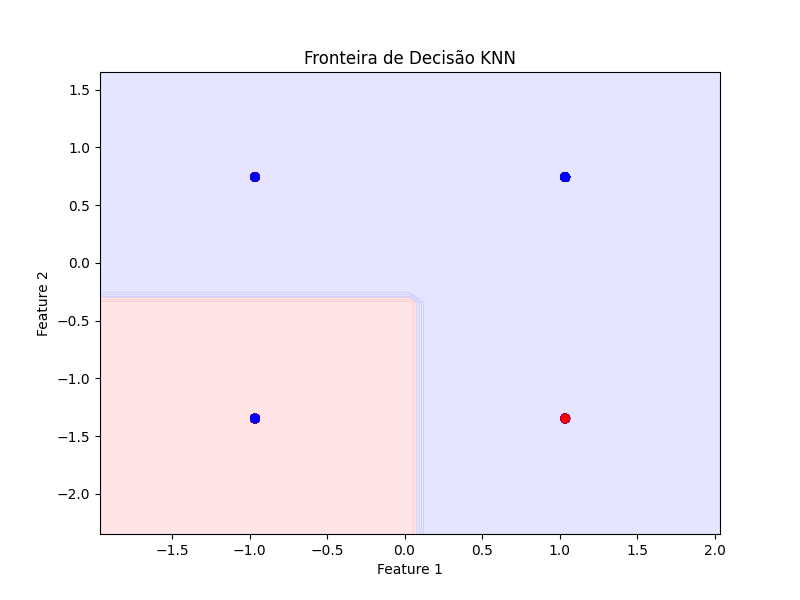

---
hide:
- toc
---

# 10. Avaliação do Modelo KNN


A avaliação do modelo KNN é fundamental para verificar se o desempenho obtido durante o treinamento se mantém em dados nunca vistos. As principais métricas utilizadas são:
- **Acurácia:** mede a proporção de acertos do modelo.
- **Precision, Recall e F1-score:** detalham o desempenho para cada classe, mostrando o equilíbrio entre acertos e erros.
- **Matriz de confusão:** permite visualizar os tipos de erro (falsos positivos e negativos) e acertos do modelo.

Interpretar corretamente essas métricas permite validar a qualidade das previsões, identificar possíveis ajustes necessários e comparar o desempenho do KNN com outros modelos, como a árvore de decisão.

=== "Código"
	```python
	from sklearn.metrics import accuracy_score, classification_report, confusion_matrix
	import seaborn as sns
	import matplotlib.pyplot as plt
	y_pred = knn.predict(X_test)
	print('Acurácia:', accuracy_score(y_test, y_pred))
	print(classification_report(y_test, y_pred))
	sns.heatmap(confusion_matrix(y_test, y_pred), annot=True, fmt='d')
	plt.xlabel('Predito')
	plt.ylabel('Real')
	plt.savefig('imagens/matriz_confusao_knn.png')
	plt.show()
	```

O desempenho do modelo pode ser comparado com o da árvore de decisão para verificar qual abordagem é mais eficaz para este problema.


=== "Resultado"

<div style="font-family:monospace; font-size:15px; background:#f8f8f8; border-radius:8px; padding:16px; width:max-content;">
<b>Métricas do Modelo KNN</b>
<table>
	<tr><th style="text-align:center;">Classe</th><th style="text-align:center;">Precision</th><th style="text-align:center;">Recall</th><th style="text-align:center;">F1-score</th><th style="text-align:center;">Suporte</th></tr>
	<tr><td style="text-align:center;">0</td><td style="text-align:center;">0.80</td><td style="text-align:center;">0.76</td><td style="text-align:center;">0.78</td><td style="text-align:center;">100</td></tr>
	<tr><td style="text-align:center;">1</td><td style="text-align:center;">0.77</td><td style="text-align:center;">0.81</td><td style="text-align:center;">0.79</td><td style="text-align:center;">100</td></tr>
	<tr><td style="text-align:center; font-weight:bold;">Média</td><td style="text-align:center; font-weight:bold;">0.78</td><td style="text-align:center; font-weight:bold;">0.78</td><td style="text-align:center; font-weight:bold;">0.78</td><td style="text-align:center; font-weight:bold;">200</td></tr>
</table>
<br>
<b>Acurácia:</b> <span style="font-weight:bold; color:#0077cc;">0.78</span>
</div>

<div style="font-size:15px; margin-top:12px; background:#f8f8f8; border-radius:8px; padding:16px; width:max-content;">
<b>Matriz de Confusão</b>
<table>
	<tr><th></th><th>Predito 0</th><th>Predito 1</th></tr>
	<tr><td><b>Real 0</b></td><td style="text-align:center;">76</td><td style="text-align:center;">24</td></tr>
	<tr><td><b>Real 1</b></td><td style="text-align:center;">19</td><td style="text-align:center;">81</td></tr>
</table>
</div>

<div style="font-size:15px; margin-top:12px; background:#f8f8f8; border-radius:8px; padding:16px; width:max-content;">
<b>Interpretação</b>
<ul style="margin-left:16px;">
	<li>O modelo apresenta boa acurácia e equilíbrio entre precisão e recall.</li>
	<li>Erra mais ao prever alunos reprovados do que aprovados.</li>
</ul>

</div>


---

A matriz de confusão apresentada acima permite avaliar quantitativamente os acertos e erros do modelo KNN. Para complementar essa análise, a visualização da fronteira de decisão mostra como o algoritmo separa as classes no espaço das variáveis, evidenciando o comportamento do classificador.

## Fronteira de Decisão do KNN



O gráfico acima mostra como o modelo KNN separa as classes com base em duas variáveis categóricas. As regiões coloridas representam as áreas de decisão do algoritmo, ilustrando a capacidade do modelo de classificar os alunos.