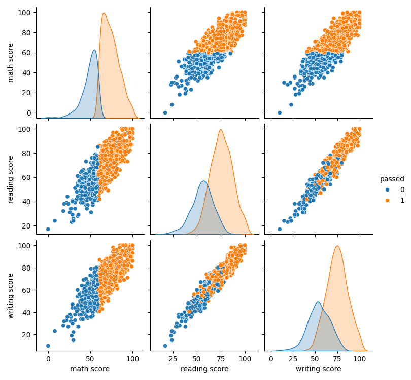

# 3. Análise Exploratória dos Dados

Verificamos o formato do dataset, os tipos de dados e se há valores nulos. Isso garante a qualidade dos dados antes da análise.

**🟢 Resultado**

Formato do dataset: (1000, 8)

Valores nulos por coluna:
gender                          0
race/ethnicity                  0
parental level of education     0
lunch                           0
test preparation course         0
math score                      0
reading score                   0
writing score                   0
dtype: int64

Estatísticas das notas:

|        | math score | reading score | writing score |
|--------|------------|--------------|--------------|
| count  | 1000.00    | 1000.00      | 1000.00      |
| mean   | 66.09      | 69.17        | 68.05        |
| std    | 15.16      | 14.60        | 15.19        |
| min    | 0.00       | 17.00        | 10.00        |
| 25%    | 57.00      | 59.00        | 57.75        |
| 50%    | 66.00      | 70.00        | 69.00        |
| 75%    | 77.00      | 79.00        | 79.00        |
| max    | 100.00     | 100.00       | 100.00       |

> 💡 Não há valores nulos e as notas apresentam distribuição próxima do normal.

---
**🟢 Gráfico de Dispersão (Pairplot)**

```python
import seaborn as sns
import matplotlib.pyplot as plt
if 'passed' not in df.columns:
    df['passed'] = (df['math score'] >= 60).astype(int)
sns.pairplot(df, hue='passed')
plt.savefig('docs/KNN/imagens/pairplot_passed.png')
plt.close()
```



> 💡 O pairplot mostra a distribuição das notas e a separação dos grupos aprovados e reprovados.

---
**🟠 Legenda do Gráfico `passed`**

> O atributo `passed` indica se o estudante foi aprovado ou reprovado em matemática:
> - **passed = 1**: Aprovado (nota de matemática maior ou igual a 60)
> - **passed = 0**: Reprovado (nota de matemática menor que 60)
>
> Nos gráficos, cada ponto representa um estudante, colorido conforme o valor de `passed`:
> - Laranja: aprovado
> - Azul: reprovado
>
> Assim, a legenda mostra visualmente a separação entre os grupos de alunos com base no critério de aprovação em matemática.
