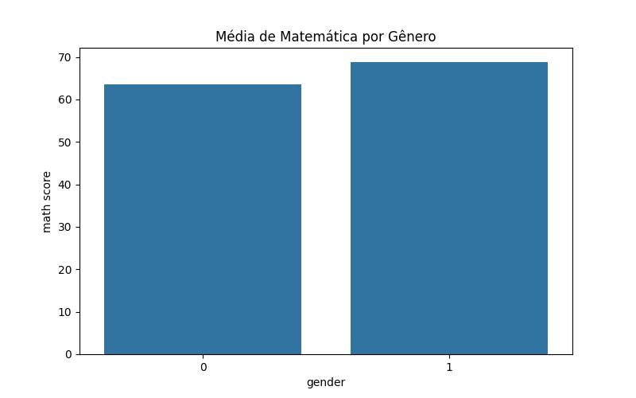
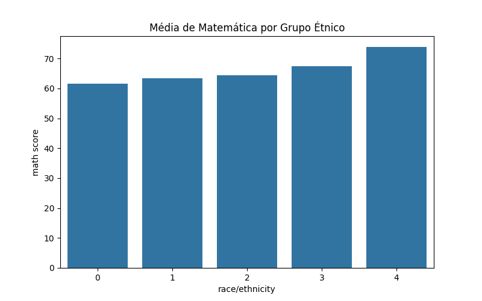

# 7. Comparação de Grupos

A comparação de médias por gênero e grupo étnico mostra diferenças entre desempenho em leitura, escrita e matemática. As diferenças entre grupos étnicos são visíveis, mas os rótulos são fictícios.


**🟢 Resultado**

Média de matemática por gênero:

| gender | math score |
|--------|------------|
| 0      | 63.37      |
| 1      | 68.73      |

Média de matemática por grupo étnico:

| race/ethnicity | math score |
|---------------|------------|
| 0             | 61.62      |
| 1             | 63.50      |
| 2             | 64.44      |
| 3             | 67.37      |
| 4             | 74.42      |

```python
import matplotlib.pyplot as plt
import seaborn as sns
fig, ax = plt.subplots(figsize=(8,5))
sns.barplot(x='gender', y='math score', data=df, ci=None, ax=ax)
plt.title('Média de Matemática por Gênero')
plt.savefig('docs/KNN/imagens/barplot_genero.png')
plt.close()
fig, ax = plt.subplots(figsize=(8,5))
sns.barplot(x='race/ethnicity', y='math score', data=df, ci=None, ax=ax)
plt.title('Média de Matemática por Grupo Étnico')
plt.savefig('docs/KNN/imagens/barplot_etnia.png')
plt.close()
```




> 💡 Os gráficos mostram as médias de notas por gênero e grupo étnico, evidenciando diferenças entre os grupos.
