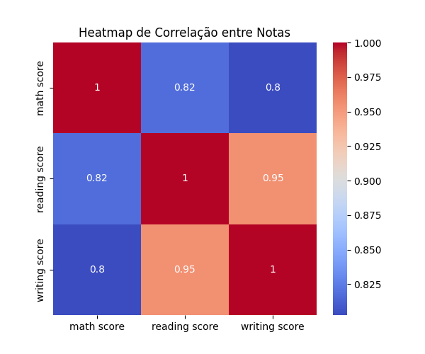

# 6. Correlação entre Variáveis

A análise de correlação entre as notas mostra que leitura e escrita têm correlação muito alta, enquanto matemática apresenta correlação moderada com as demais.

**🟢 Resultado**

|                | math score | reading score | writing score |
|----------------|------------|--------------|--------------|
| math score     | 1.00       | 0.82         | 0.80         |
| reading score  | 0.82       | 1.00         | 0.95         |
| writing score  | 0.80       | 0.95         | 1.00         |

> 💡 O heatmap mostra forte correlação entre leitura e escrita, e correlação moderada entre matemática e as demais.
