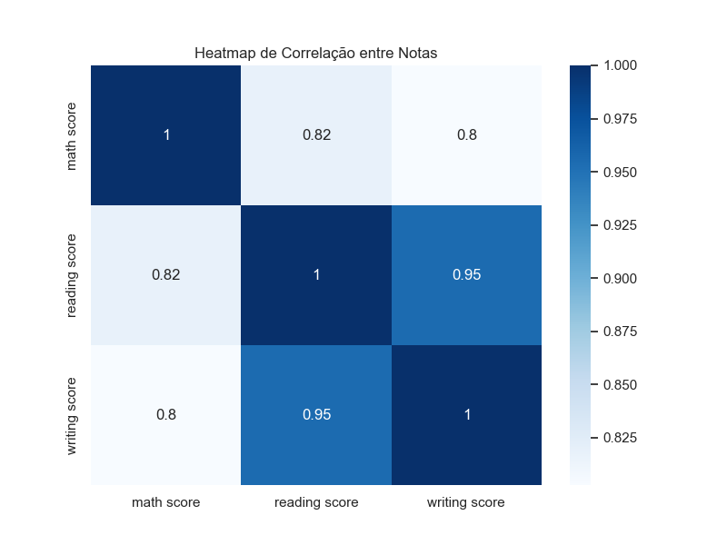

---
hide:
- toc
---

# 6. Correlação entre Variáveis


A análise de correlação é fundamental para entender como as diferentes disciplinas se relacionam. Correlações altas indicam que o desempenho em uma matéria pode estar fortemente associado ao desempenho em outra, enquanto correlações baixas sugerem maior independência entre as áreas.

Visualizar a matriz de correlação e o heatmap facilita a identificação de padrões, redundâncias e possíveis oportunidades para simplificação do modelo. Essas informações são úteis tanto para a interpretação dos dados quanto para a escolha de variáveis em etapas futuras do projeto.

=== "Código"
	```python
	corr = df[['math score', 'reading score', 'writing score']].corr()
	print('Matriz de correlação:')
	print(corr)

	plt.figure(figsize=(8, 6))
	sns.heatmap(corr, annot=True, cmap='Blues')
	plt.title('Heatmap de Correlação entre Notas')
	plt.savefig('imagens/heatmap_correlacao.png')
	plt.show()
	from IPython.display import Image, display
	display(Image(filename='imagens/heatmap_correlacao.png'))
	```
=== "Resultado"
	As notas de leitura e escrita têm correlação muito alta (acima de 0.95), indicando que estudantes que vão bem em uma tendem a ir bem na outra. Matemática tem correlação moderada com as demais.
	
