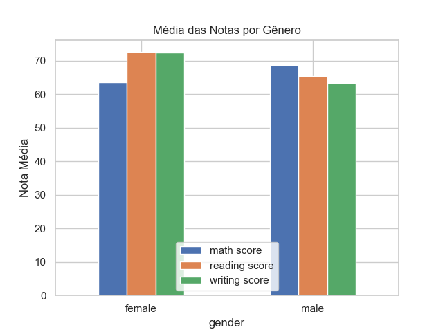
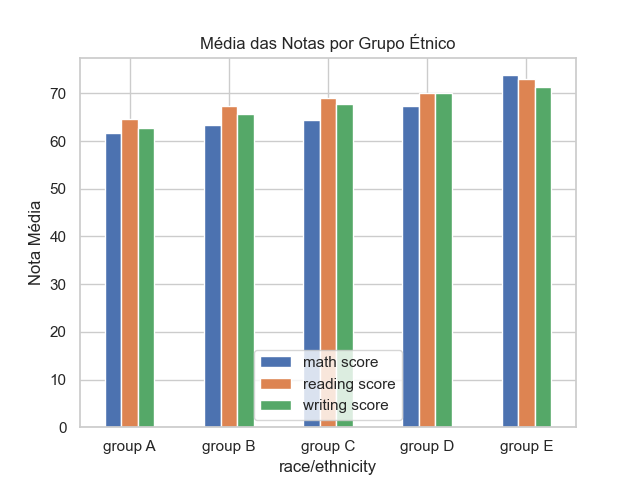

---
hide:
- toc
---

# 7. Filtrar e Agrupar Dados por Gênero ou Grupo Étnico

Aqui comparamos médias de desempenho entre diferentes grupos de estudantes. Para gênero, observamos diferenças nas médias das notas. Para grupo étnico, analisamos os rótulos genéricos do dataset.

> **Nota:** Os grupos étnicos são apenas rótulos fictícios e não representam etnias reais.

=== "Código"
	```python
	# Médias das notas por gênero
	gender_group = df.groupby('gender')[['math score', 'reading score', 'writing score']].mean()
	print('Médias das notas por gênero:')
	print(gender_group)

	# Médias das notas por grupo étnico
	ethnic_group = df.groupby('race/ethnicity')[['math score', 'reading score', 'writing score']].mean()
	print('\nMédias das notas por grupo étnico:')
	print(ethnic_group)

	# Visualização
	plt.figure(figsize=(10, 5))
	gender_group.plot(kind='bar')
	plt.title('Média das Notas por Gênero')
	plt.ylabel('Nota Média')
	plt.xticks(rotation=0)
	plt.savefig('imagens/barplot_genero.png')
	plt.show()
	from IPython.display import Image, display
	display(Image(filename='imagens/barplot_genero.png'))

	plt.figure(figsize=(10, 5))
	ethnic_group.plot(kind='bar')
	plt.title('Média das Notas por Grupo Étnico')
	plt.ylabel('Nota Média')
	plt.xticks(rotation=0)
	plt.savefig('imagens/barplot_etnia.png')
	plt.show()
	display(Image(filename='imagens/barplot_etnia.png'))
	```
=== "Resultado"
	As médias por gênero mostram que estudantes do gênero feminino têm desempenho superior em leitura e escrita, enquanto o masculino tem média ligeiramente maior em matemática. As diferenças entre grupos étnicos (rótulos) também são visíveis, mas não podem ser interpretadas como diferenças reais entre etnias.
	
	
