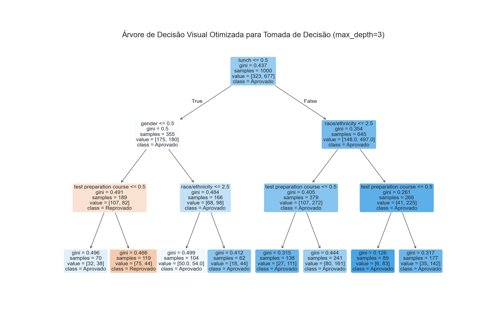

# 12. Árvore de Decisão Visual (Classificação Aprovação/Reprovação)

Antes de visualizar a árvore, criamos uma variável de classificação para aprovação/reprovação:
```python
X_visu = df.drop(['math score', 'reading score', 'writing score'], axis=1)
y_visu = (df['math score'] >= 60).astype(int)  # 1 = aprovado, 0 = reprovado
```

Esta árvore foi gerada para maximizar a clareza e a interpretação dos critérios de decisão, utilizando os melhores hiperparâmetros encontrados na otimização. Para facilitar a visualização dos nós inferiores, a profundidade foi limitada e a árvore foi exportada em formato PNG.

=== "Código"
	```python
	# Árvore de decisão visual otimizada para tomada de decisão
	from sklearn import tree
	import matplotlib.pyplot as plt
	import matplotlib
	matplotlib.use('Agg')
	import os
	from IPython.display import Image, display
	os.makedirs('docs/arvore_decisao/imagens', exist_ok=True)

	clf_otimizada = DecisionTreeClassifier(
		max_depth=3,
		min_samples_split=best_tree.get_params().get('min_samples_split', 2),
		min_samples_leaf=best_tree.get_params().get('min_samples_leaf', 1),
		max_features=best_tree.get_params().get('max_features', None),
		random_state=42
	)
	clf_otimizada.fit(X_visu, y_visu)

	fig = plt.figure(figsize=(18, 12), dpi=120)
	tree.plot_tree(
		clf_otimizada,
		feature_names=X_visu.columns,
		class_names=['Reprovado', 'Aprovado'],
		filled=True,
		rounded=True,
		fontsize=14
	)
	plt.title('Árvore de Decisão Visual Otimizada para Tomada de Decisão (max_depth=3)', fontsize=20)
	plt.savefig('imagens/arvore_decisao_visual_otimizada.png')
	plt.close(fig)

	print('Imagem PNG salva como imagens/arvore_decisao_visual_otimizada.png')
	display(Image(filename='imagens/arvore_decisao_visual_otimizada.png'))
	```
=== "Resultado"
	A imagem abaixo mostra a árvore de decisão otimizada, ideal para apoiar decisões e interpretar os critérios utilizados pelo modelo.
	
