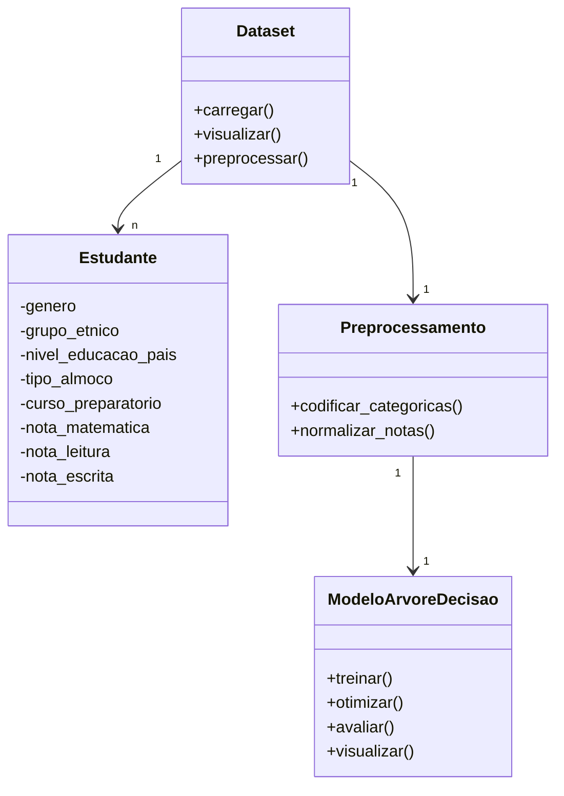

---
hide:
- toc
---

# Análise de Desempenho de Estudantes em Exames

Este relatório segue as etapas do projeto de árvore de decisão, utilizando o dataset 'Students Performance in Exams' do Kaggle. O objetivo é explorar, analisar e preparar os dados para classificação, explicando cada etapa, resultados e limitações do conjunto de dados.

## Estrutura do Modelo de Árvore de Decisão

O diagrama abaixo representa, de forma simplificada, as principais classes e relações envolvidas na construção e aplicação da árvore de decisão para análise de desempenho dos estudantes.

