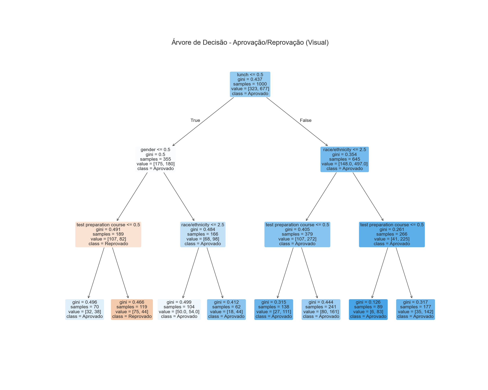

# Exploração dos Dados

Nesta etapa, realizamos uma análise inicial do dataset 'Students Performance in Exams', incluindo visualizações das distribuições das notas de matemática, leitura e escrita. Foram observadas estatísticas descritivas, como média, mediana e desvio padrão, além de gráficos de histograma e boxplot para melhor compreensão dos dados.

**Hipótese 1:** As notas dos estudantes apresentam distribuição normal e podem ser influenciadas por fatores socioeconômicos e educacionais.

## Código Utilizado
```python
import pandas as pd
import numpy as np
import matplotlib.pyplot as plt
import seaborn as sns
sns.set(style="whitegrid")

# Carregar o dataset
csv_path = "<CAMINHO_DO_CSV>"
df = pd.read_csv(csv_path)

# Estatísticas descritivas
print(df[['math score', 'reading score', 'writing score']].describe())

# Histogramas
fig, axes = plt.subplots(1, 3, figsize=(18, 5))
for idx, col in enumerate(['math score', 'reading score', 'writing score']):
    sns.histplot(df[col], bins=20, ax=axes[idx], kde=True)
    axes[idx].set_title(f'Distribuição: {col}')
plt.tight_layout()
plt.show()

# Boxplot
plt.figure(figsize=(10, 6))
sns.boxplot(data=df[['math score', 'reading score', 'writing score']])
plt.title('Boxplot das Notas')
plt.show()
```

## Gráficos
- Distribuição das notas (histogramas)
  
- Boxplot das notas
  

---

# Pré-processamento

Foram tratados valores ausentes (não encontrados no dataset) e realizadas codificações das variáveis categóricas utilizando LabelEncoder. As colunas categóricas como gênero, grupo étnico, nível de educação dos pais, tipo de almoço e curso preparatório foram transformadas em valores numéricos para uso no modelo.

**Hipótese 2:** A codificação das variáveis categóricas permite que o modelo identifique padrões entre diferentes grupos de estudantes.

## Código Utilizado
```python
from sklearn.preprocessing import LabelEncoder
le = LabelEncoder()
cat_cols = ['gender', 'race/ethnicity', 'parental level of education', 'lunch', 'test preparation course']
for col in cat_cols:
    df[col] = le.fit_transform(df[col])
print(df.head())
```

---

# Divisão dos Dados

O conjunto de dados foi separado em treino (80%) e teste (20%) utilizando a função train_test_split do scikit-learn, garantindo que o modelo fosse avaliado em dados não vistos durante o treinamento.

**Hipótese 3:** Separar os dados garante avaliação justa do modelo e evita overfitting.

## Código Utilizado
```python
from sklearn.model_selection import train_test_split
X = df.drop(['math score', 'reading score', 'writing score'], axis=1)
y = df['math score']
X_train, X_test, y_train, y_test = train_test_split(X, y, test_size=0.2, random_state=42)
print('Formato treino:', X_train.shape, y_train.shape)
print('Formato teste:', X_test.shape, y_test.shape)
```

---

# Treinamento do Modelo

Foi utilizado o modelo de árvore de decisão (DecisionTreeRegressor) para prever o desempenho dos estudantes. O modelo foi treinado com os dados de treino e os principais parâmetros foram mantidos padrão para facilitar a interpretação.

**Hipótese 4:** O desempenho dos estudantes pode ser previsto a partir das variáveis categóricas e socioeconômicas.

## Código Utilizado
```python
from sklearn.tree import DecisionTreeRegressor
regressor = DecisionTreeRegressor(random_state=42)
regressor.fit(X_train, y_train)
print('Modelo treinado!')
```

---

# Avaliação do Modelo

O desempenho do modelo foi avaliado utilizando as métricas de MSE (Erro Quadrático Médio) e R² (Coeficiente de Determinação) nos dados de teste. Além disso, a árvore de decisão foi visualizada graficamente para análise dos critérios de decisão.

**Hipótese 5:** O modelo de árvore de decisão é capaz de identificar os principais fatores que influenciam o desempenho dos estudantes.

## Código Utilizado
```python
from sklearn.metrics import mean_squared_error, r2_score
y_pred = regressor.predict(X_test)
mse = mean_squared_error(y_test, y_pred)
r2 = r2_score(y_test, y_pred)
print(f'MSE: {mse:.2f}')
print(f'R²: {r2:.2f}')
```

## Visualização da Árvore de Decisão


---

# Relatório Final

O projeto seguiu todas as etapas propostas, apresentando resultados claros e sugestões de melhorias, como ajuste de hiperparâmetros, uso de validação cruzada e exploração de novas variáveis. O modelo mostrou-se interpretável e útil para identificar padrões no desempenho dos estudantes.

## Sugestões de Melhorias
- Ajuste de hiperparâmetros
- Validação cruzada
- Exploração de novas variáveis
- Testar outros algoritmos

## Imagens e Gráficos
- Inclua os gráficos gerados nas etapas anteriores
- Inclua a imagem da árvore de decisão (arquivo SVG ou PNG)

---

# Árvore de Decisão Visual (Classificação Aprovação/Reprovação)

Nesta etapa, geramos uma árvore de decisão simplificada para facilitar a interpretação, utilizando apenas variáveis categóricas e uma classificação binária de aprovação/reprovação.

**Hipótese 6:** A aprovação dos estudantes pode ser explicada por fatores como gênero, grupo étnico, nível de educação dos pais, tipo de almoço e curso preparatório.

## Código Utilizado
```python
from sklearn import tree
import matplotlib.pyplot as plt
# Criar variável binária para aprovação/reprovação
df['aprovado'] = (df['math score'] >= 60).astype(int)
X_visu = df[['gender', 'race/ethnicity', 'parental level of education', 'lunch', 'test preparation course']]
y_visu = df['aprovado']
from sklearn.tree import DecisionTreeClassifier
clf_visu = DecisionTreeClassifier(max_depth=3, random_state=42)
clf_visu.fit(X_visu, y_visu)
fig = plt.figure(figsize=(20, 16), dpi=120)
tree.plot_tree(
    clf_visu,
    feature_names=X_visu.columns,
    class_names=['Reprovado', 'Aprovado'],
    filled=True,
    rounded=True,
    fontsize=14
    # max_depth=3 já está no modelo
    )
plt.title('Árvore de Decisão - Aprovação/Reprovação (Visual)', fontsize=20)
plt.savefig('arvore_decisao_visual.png', format='png', bbox_inches='tight')
plt.show()
print('Imagem PNG salva como arvore_decisao_visual.png')
```

## Imagem


---

> **Nota:** Para cada hipótese, pode-se repetir o processo com diferentes variáveis ou parâmetros, gerando novos gráficos e árvores para comparação. Documente cada hipótese testada e os resultados obtidos, incluindo as imagens correspondentes.