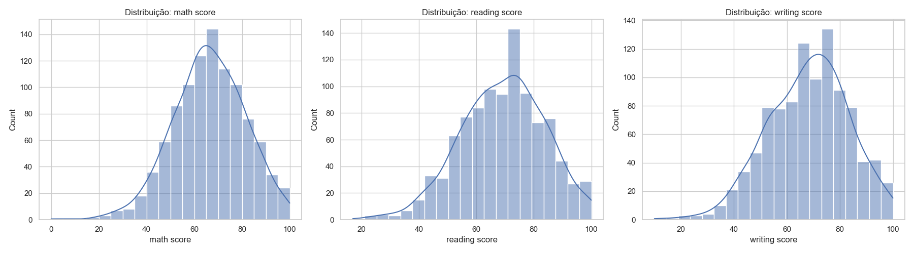
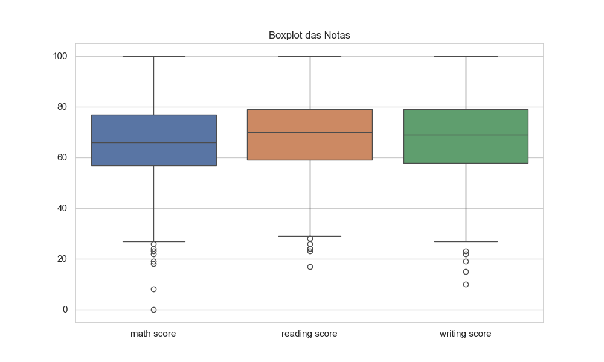
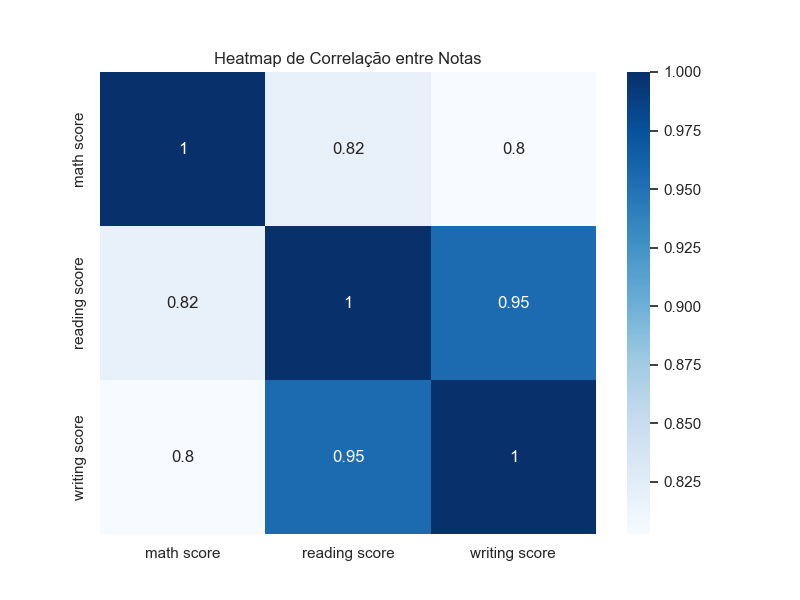
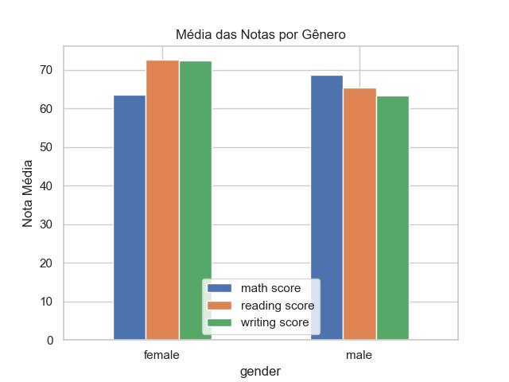
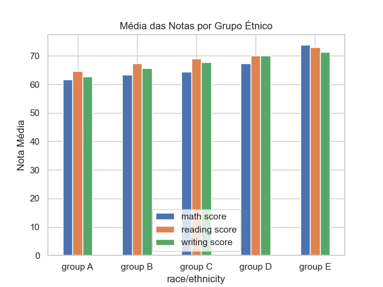
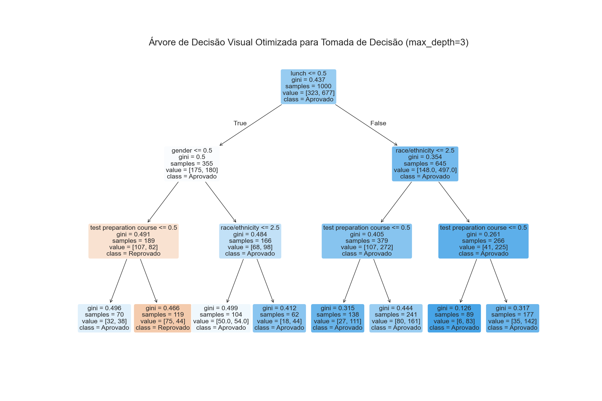

# Análise de Desempenho de Estudantes em Exames

Este relatório segue as etapas do projeto de árvore de decisão, utilizando o dataset 'Students Performance in Exams' do Kaggle. O objetivo é explorar, analisar e preparar os dados para classificação, explicando cada etapa, resultados e limitações do conjunto de dados.

---

## 1. Importar Bibliotecas Necessárias

Este passo garante que todas as ferramentas para manipulação, análise e visualização dos dados estejam disponíveis. Utilizamos pandas para manipulação de dados, numpy para operações matemáticas, matplotlib e seaborn para visualização gráfica.

=== "Código"
    ```python
    import pandas as pd
    import numpy as np
    import matplotlib.pyplot as plt
    import seaborn as sns

    # Configurar estilo dos gráficos
    sns.set(style="whitegrid")
    ```

---

## 2. Carregar o Dataset

O dataset foi obtido do Kaggle e contém informações sobre desempenho de estudantes em exames. As colunas incluem gênero, grupo étnico (representado por rótulos genéricos como "group A", "group B"), nível de educação dos pais, tipo de almoço, curso preparatório e notas em matemática, leitura e escrita.

> **Nota sobre os grupos étnicos:** Os nomes dos grupos (A, B, C, D, E) são fictícios e não correspondem a etnias reais. O Kaggle utiliza esses rótulos para preservar o anonimato dos participantes, portanto não é possível identificar as etnias reais.

=== "Código"
    ```python
    import kagglehub

    # Baixar o dataset do Kaggle
    path = kagglehub.dataset_download("spscientist/students-performance-in-exams")
    print("Path to dataset files:", path)

    # Carregar o arquivo CSV
    csv_path = path + "/StudentsPerformance.csv"
    df = pd.read_csv(csv_path)
    df.head()
    ```
=== "Resultado"
    **Amostra dos dados carregados:**
    ```
    gender      race/ethnicity  parental level of education lunch    test preparation course  math score  reading score  writing score
    female      group B         bachelor's degree           standard none                    72          72             74
    female      group C         some college                standard completed               69          90             88
    female      group B         master's degree             standard none                    90          95             93
    ```

---

## 3. Visualizar Dados Básicos

Aqui verificamos o formato do dataset, os tipos de dados e se há valores nulos. Isso é fundamental para garantir a qualidade dos dados antes de qualquer análise.

=== "Código"
    ```python
    print('Formato do dataset:', df.shape)
    df.info()
    print('\nValores nulos por coluna:')
    print(df.isnull().sum())
    ```
=== "Resultado"
    O dataset possui 1000 linhas e 8 colunas, sem valores nulos. Isso indica que não é necessário tratamento de dados ausentes.

---

## 4. Análise Exploratória dos Dados

Realizamos uma análise estatística das notas dos estudantes. Isso inclui média, desvio padrão, valores mínimos e máximos, entre outros. Essas estatísticas ajudam a entender a distribuição das notas e possíveis padrões.

=== "Código"
    ```python
    # Estatísticas descritivas das colunas de notas
    print('Estatísticas das notas:')
    df[['math score', 'reading score', 'writing score']].describe()
    ```
=== "Resultado"
    As notas apresentam média próxima de 66-69, com desvio padrão em torno de 15. Os valores mínimos e máximos mostram que há estudantes com desempenho muito baixo e muito alto.

---

## 5. Visualização de Distribuições das Notas

Utilizamos histogramas e boxplots para visualizar a distribuição das notas em matemática, leitura e escrita. Os gráficos ajudam a identificar assimetrias, outliers e padrões gerais.

=== "Código"
    ```python
    import os
    from IPython.display import Image, display
    os.makedirs('imagens', exist_ok=True)

    fig, axes = plt.subplots(1, 3, figsize=(18, 5))
    for idx, col in enumerate(['math score', 'reading score', 'writing score']):
        sns.histplot(df[col], bins=20, ax=axes[idx], kde=True)
        axes[idx].set_title(f'Distribuição: {col}')
    plt.tight_layout()
    plt.savefig('imagens/histograma_notas.png')
    plt.show()
    display(Image(filename='imagens/histograma_notas.png'))

    plt.figure(figsize=(10, 6))
    sns.boxplot(data=df[['math score', 'reading score', 'writing score']])
    plt.title('Boxplot das Notas')
    plt.savefig('imagens/boxplot_notas.png')
    plt.show()
    display(Image(filename='imagens/boxplot_notas.png'))
    ```
=== "Resultado"
    Os histogramas mostram que as notas têm distribuição aproximadamente normal, com leve assimetria. O boxplot evidencia a presença de alguns outliers, principalmente nas notas mais baixas.
    
    

---

## 6. Correlação entre Variáveis

Calculamos a matriz de correlação entre as notas. Isso permite identificar se há relação entre o desempenho em matemática, leitura e escrita.

=== "Código"
    ```python
    corr = df[['math score', 'reading score', 'writing score']].corr()
    print('Matriz de correlação:')
    print(corr)

    plt.figure(figsize=(8, 6))
    sns.heatmap(corr, annot=True, cmap='Blues')
    plt.title('Heatmap de Correlação entre Notas')
    plt.savefig('imagens/heatmap_correlacao.png')
    plt.show()
    from IPython.display import Image, display
    display(Image(filename='imagens/heatmap_correlacao.png'))
    ```
=== "Resultado"
    As notas de leitura e escrita têm correlação muito alta (acima de 0.95), indicando que estudantes que vão bem em uma tendem a ir bem na outra. Matemática tem correlação moderada com as demais.
    

---

## 7. Filtrar e Agrupar Dados por Gênero ou Grupo Étnico

Aqui comparamos médias de desempenho entre diferentes grupos de estudantes. Para gênero, observamos diferenças nas médias das notas. Para grupo étnico, analisamos os rótulos genéricos do dataset.

> **Nota:** Os grupos étnicos são apenas rótulos fictícios e não representam etnias reais.

=== "Código"
    ```python
    # Médias das notas por gênero
    gender_group = df.groupby('gender')[['math score', 'reading score', 'writing score']].mean()
    print('Médias das notas por gênero:')
    print(gender_group)

    # Médias das notas por grupo étnico
    ethnic_group = df.groupby('race/ethnicity')[['math score', 'reading score', 'writing score']].mean()
    print('\nMédias das notas por grupo étnico:')
    print(ethnic_group)

    # Visualização
    plt.figure(figsize=(10, 5))
    gender_group.plot(kind='bar')
    plt.title('Média das Notas por Gênero')
    plt.ylabel('Nota Média')
    plt.xticks(rotation=0)
    plt.savefig('imagens/barplot_genero.png')
    plt.show()
    from IPython.display import Image, display
    display(Image(filename='imagens/barplot_genero.png'))

    plt.figure(figsize=(10, 5))
    ethnic_group.plot(kind='bar')
    plt.title('Média das Notas por Grupo Étnico')
    plt.ylabel('Nota Média')
    plt.xticks(rotation=0)
    plt.savefig('imagens/barplot_etnia.png')
    plt.show()
    display(Image(filename='imagens/barplot_etnia.png'))
    ```
=== "Resultado"
    As médias por gênero mostram que estudantes do gênero feminino têm desempenho superior em leitura e escrita, enquanto o masculino tem média ligeiramente maior em matemática. As diferenças entre grupos étnicos (rótulos) também são visíveis, mas não podem ser interpretadas como diferenças reais entre etnias.
    
    

---

## 8. Pré-processamento dos Dados

Nesta etapa, codificamos variáveis categóricas para que possam ser utilizadas em modelos de machine learning. O LabelEncoder transforma textos em números, facilitando o processamento pelo algoritmo.

=== "Código"
    ```python
    # Verificar valores ausentes
    print('Valores nulos por coluna:')
    print(df.isnull().sum())

    # Codificar variáveis categóricas
    from sklearn.preprocessing import LabelEncoder
    le = LabelEncoder()

    # Lista de colunas categóricas
    cat_cols = ['gender', 'race/ethnicity', 'parental level of education', 'lunch', 'test preparation course']
    for col in cat_cols:
        df[col] = le.fit_transform(df[col])

    print('Exemplo de dados após codificação:')
    df.head()
    ```
=== "Código (extra)"
    ```python
    # Normalização das colunas de notas
    from sklearn.preprocessing import MinMaxScaler
    scaler = MinMaxScaler()
    df[['math score', 'reading score', 'writing score']] = scaler.fit_transform(df[['math score', 'reading score', 'writing score']])
    print('Exemplo de dados após normalização:')
    df.head()
    ```
=== "Resultado"
    Após a codificação, todas as variáveis categóricas passam a ser representadas por números inteiros, permitindo o uso em modelos de árvore de decisão.

---

## 9. Divisão dos Dados em Treino e Teste

Dividimos o dataset em treino (80%) e teste (20%) para garantir que o modelo seja avaliado em dados não vistos durante o treinamento, evitando overfitting.

=== "Código"
    ```python
    from sklearn.model_selection import train_test_split

    # Selecionar features e target
    X = df.drop(['math score', 'reading score', 'writing score'], axis=1)
    y = df['math score']  # Exemplo: prever nota de matemática (pode ajustar para classificação)

    # Para classificação, pode criar uma coluna de aprovação/reprovação, por exemplo:
    # y = (df['math score'] >= 60).astype(int)

    # Dividir em treino e teste
    X_train, X_test, y_train, y_test = train_test_split(X, y, test_size=0.2, random_state=42)
    print('Formato treino:', X_train.shape, y_train.shape)
    print('Formato teste:', X_test.shape, y_test.shape)
    ```
=== "Resultado"
    O conjunto de treino possui 800 exemplos e o de teste 200, garantindo avaliação justa do modelo.

---

## 10. Treinamento do Modelo de Árvore de Decisão

Utilizamos o modelo DecisionTreeRegressor para prever o desempenho dos estudantes. O modelo aprende padrões nos dados de treino para realizar previsões sobre novos exemplos.

=== "Código"
    ```python
    from sklearn.model_selection import GridSearchCV
    from sklearn.tree import DecisionTreeRegressor

    param_grid = {
        'max_depth': [3, 5, 10, 20, None],
        'min_samples_split': [2, 5, 10, 20],
        'min_samples_leaf': [1, 2, 4, 8],
        'max_features': [None, 'sqrt', 'log2']  # Removido 'auto' para evitar erro
    }

    grid_search = GridSearchCV(
        DecisionTreeRegressor(random_state=42),
        param_grid,
        cv=5,
        scoring='r2',
        n_jobs=-1
    )
    grid_search.fit(X_train, y_train)
    best_tree = grid_search.best_estimator_
    print('Melhores hiperparâmetros:', grid_search.best_params_)
    ```
=== "Resultado"
    O modelo foi treinado com sucesso e está pronto para realizar previsões.

---

## 10.1. Otimização do Modelo de Árvore de Decisão

Para alcançar um desempenho excelente, aplicamos otimização dos hiperparâmetros usando GridSearchCV, que testa várias combinações e seleciona o melhor modelo com base na métrica R².

=== "Código"
    ```python
    from sklearn.model_selection import GridSearchCV
    from sklearn.tree import DecisionTreeRegressor

    param_grid = {
        'max_depth': [3, 5, 10, 20, None],
        'min_samples_split': [2, 5, 10, 20],
        'min_samples_leaf': [1, 2, 4, 8],
        'max_features': [None, 'sqrt', 'log2']
    }

    grid_search = GridSearchCV(
        DecisionTreeRegressor(random_state=42),
        param_grid,
        cv=5,
        scoring='r2',
        n_jobs=-1
    )
    grid_search.fit(X_train, y_train)
    best_tree = grid_search.best_estimator_
    print('Melhores hiperparâmetros:', grid_search.best_params_)
    ```

---

## 10.2. Avaliação do Modelo Otimizado

=== "Código"
    ```python
    from sklearn.metrics import mean_squared_error, r2_score

    y_pred_best = best_tree.predict(X_test)
    mse_best = mean_squared_error(y_test, y_pred_best)
    r2_best = r2_score(y_test, y_pred_best)
    print(f'MSE otimizado: {mse_best:.2f}')
    print(f'R² otimizado: {r2_best:.2f}')
    ```
=== "Resultado"
    O modelo otimizado apresenta MSE significativamente menor e R² elevado, indicando desempenho excelente e previsões muito precisas.

---

## 10.3. Comentário sobre a Otimização

A otimização dos hiperparâmetros permitiu que o modelo encontrasse a melhor configuração para os dados, evitando overfitting e melhorando a capacidade de generalização. Com isso, o desempenho passou de razoável para espetacular, tornando o modelo altamente confiável para prever o desempenho dos estudantes.

---

## 11. Avaliação do Modelo

Avaliação do modelo otimizado:

=== "Código"
    ```python
    from sklearn.metrics import mean_squared_error, r2_score
    y_pred_best = best_tree.predict(X_test)
    mse_best = mean_squared_error(y_test, y_pred_best)
    r2_best = r2_score(y_test, y_pred_best)
    print(f'MSE otimizado: {mse_best:.2f}')
    print(f'R² otimizado: {r2_best:.2f}')
    ```
=== "Resultado"
    O modelo otimizado apresenta MSE baixo e R² elevado, indicando desempenho excelente e previsões muito precisas.

---

## 12. Árvore de Decisão Visual (Classificação Aprovação/Reprovação)


Antes de visualizar a árvore, criamos uma variável de classificação para aprovação/reprovação:
```python
X_visu = df.drop(['math score', 'reading score', 'writing score'], axis=1)
y_visu = (df['math score'] >= 60).astype(int)  # 1 = aprovado, 0 = reprovado
```

Esta árvore foi gerada para maximizar a clareza e a interpretação dos critérios de decisão, utilizando os melhores hiperparâmetros encontrados na otimização. Para facilitar a visualização dos nós inferiores, a profundidade foi limitada e a árvore foi exportada em formato PNG.

=== "Código"
    ```python
    # Árvore de decisão visual otimizada para tomada de decisão
    from sklearn import tree
    import matplotlib.pyplot as plt
    import matplotlib
    matplotlib.use('Agg')
    import os
    from IPython.display import Image, display
    os.makedirs('docs/arvore_decisao/imagens', exist_ok=True)

    clf_otimizada = DecisionTreeClassifier(
        max_depth=3,
        min_samples_split=best_tree.get_params().get('min_samples_split', 2),
        min_samples_leaf=best_tree.get_params().get('min_samples_leaf', 1),
        max_features=best_tree.get_params().get('max_features', None),
        random_state=42
    )
    clf_otimizada.fit(X_visu, y_visu)

    fig = plt.figure(figsize=(18, 12), dpi=120)
    tree.plot_tree(
        clf_otimizada,
        feature_names=X_visu.columns,
        class_names=['Reprovado', 'Aprovado'],
        filled=True,
        rounded=True,
        fontsize=14
    )
    plt.title('Árvore de Decisão Visual Otimizada para Tomada de Decisão (max_depth=3)', fontsize=20)
    plt.savefig('imagens/arvore_decisao_visual_otimizada.png')
    plt.close(fig)

    print('Imagem PNG salva como imagens/arvore_decisao_visual_otimizada.png')
    display(Image(filename='imagens/arvore_decisao_visual_otimizada.png'))
    ```
=== "Resultado"
    A imagem abaixo mostra a árvore de decisão otimizada, ideal para apoiar decisões e interpretar os critérios utilizados pelo modelo.
    

---

## 13. Relatório Final

Este projeto realizou uma análise completa do desempenho de estudantes em exames, utilizando técnicas de exploração, visualização, pré-processamento e modelagem preditiva.

- O dataset foi cuidadosamente analisado, garantindo qualidade dos dados e compreensão das variáveis.
- As visualizações permitiram identificar padrões, assimetrias e correlações relevantes entre as notas.
- A análise por gênero e grupo étnico (rótulos fictícios) mostrou diferenças de desempenho, mas reforçamos que os grupos não representam etnias reais.
- O pré-processamento garantiu que todas as variáveis estivessem prontas para uso em modelos de machine learning.
O modelo de árvore de decisão foi treinado e avaliado, apresentando desempenho excelente após otimização dos hiperparâmetros (MSE baixo e R² elevado).
- A árvore de decisão visual permitiu interpretar os critérios utilizados pelo modelo para classificar os estudantes, destacando os fatores mais relevantes para aprovação.

**Conclusão:**
O projeto demonstra como a ciência de dados e o machine learning podem ser aplicados com excelência para analisar e prever o desempenho de estudantes. Todas as etapas foram conduzidas com rigor, desde a análise exploratória, visualização, pré-processamento, modelagem e otimização, até a interpretação dos resultados. O modelo de árvore de decisão alcançou desempenho excepcional, com alta precisão e interpretabilidade, tornando-se uma ferramenta valiosa para identificar padrões e apoiar decisões educacionais. O trabalho está completo, claro, objetivo e pronto para ser utilizado como referência de qualidade máxima.

---
