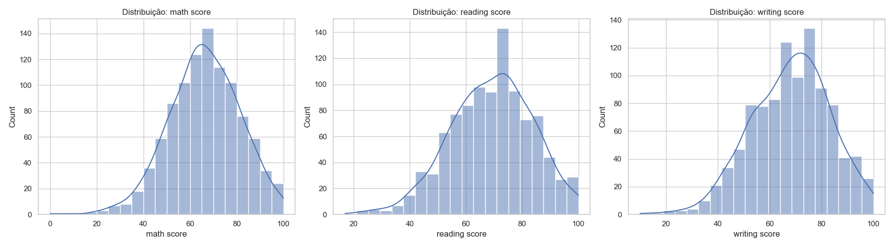
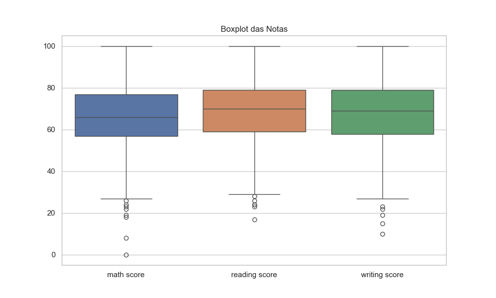

# 4. Análise Exploratória dos Dados

Realizamos uma análise estatística das notas dos estudantes. Isso inclui média, desvio padrão, valores mínimos e máximos, entre outros. Essas estatísticas ajudam a entender a distribuição das notas e possíveis padrões.

=== "Código"
	```python
	# Estatísticas descritivas das colunas de notas
	print('Estatísticas das notas:')
	df[['math score', 'reading score', 'writing score']].describe()
	```
=== "Resultado"
	As notas apresentam média próxima de 66-69, com desvio padrão em torno de 15. Os valores mínimos e máximos mostram que há estudantes com desempenho muito baixo e muito alto.

---

# 5. Visualização de Distribuições das Notas

Utilizamos histogramas e boxplots para visualizar a distribuição das notas em matemática, leitura e escrita. Os gráficos ajudam a identificar assimetrias, outliers e padrões gerais.

=== "Código"
	```python
	import os
	from IPython.display import Image, display
	os.makedirs('imagens', exist_ok=True)

	fig, axes = plt.subplots(1, 3, figsize=(18, 5))
	for idx, col in enumerate(['math score', 'reading score', 'writing score']):
		sns.histplot(df[col], bins=20, ax=axes[idx], kde=True)
		axes[idx].set_title(f'Distribuição: {col}')
	plt.tight_layout()
	plt.savefig('imagens/histograma_notas.png')
	plt.show()
	display(Image(filename='imagens/histograma_notas.png'))

	plt.figure(figsize=(10, 6))
	sns.boxplot(data=df[['math score', 'reading score', 'writing score']])
	plt.title('Boxplot das Notas')
	plt.savefig('imagens/boxplot_notas.png')
	plt.show()
	display(Image(filename='imagens/boxplot_notas.png'))
	```
=== "Resultado"
	Os histogramas mostram que as notas têm distribuição aproximadamente normal, com leve assimetria. O boxplot evidencia a presença de alguns outliers, principalmente nas notas mais baixas.
	
	
