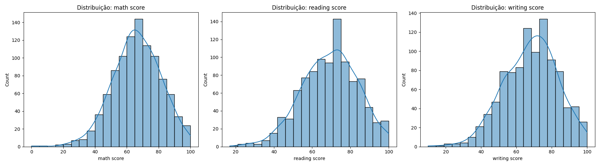
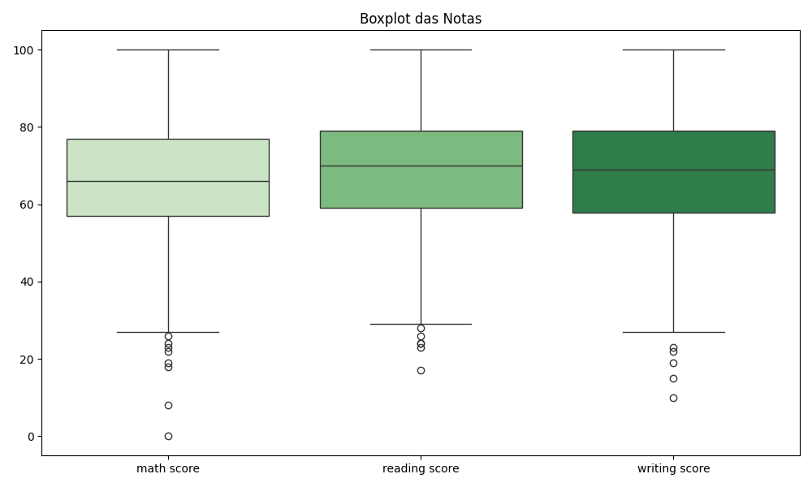

---
hide:
- toc
---

# 4. Visualização das Notas


Visualizar a distribuição das notas é fundamental para identificar padrões, assimetrias, presença de outliers e diferenças entre as disciplinas. Histogramas mostram como as notas se distribuem (por exemplo, se há concentração em determinadas faixas ou caudas longas), enquanto boxplots facilitam a comparação entre as variáveis e destacam possíveis valores extremos.

Essas análises ajudam a entender a variabilidade do desempenho dos estudantes e fornecem subsídios para decisões sobre normalização, tratamento de outliers e seleção de variáveis para o agrupamento. Uma boa visualização pode revelar grupos naturais ou tendências que serão exploradas pelo K-means.


=== "Código"
    ```python
    # Histogramas das notas
    fig, axes = plt.subplots(1, 3, figsize=(18, 5))
    for idx, col in enumerate(['math score', 'reading score', 'writing score']):
    sns.histplot(df[col], bins=20, ax=axes[idx], kde=True)
    axes[idx].set_title(f'Distribuição: {col}')
    plt.tight_layout()
    plt.show()
    plt.close(fig)

    # Boxplot das notas
    fig2, ax2 = plt.subplots(figsize=(10, 6))
    sns.boxplot(data=df[['math score', 'reading score', 'writing score']], ax=ax2)
    ax2.set_title('Boxplot das Notas')
    plt.tight_layout()
    plt.show()
    plt.close(fig2)
    ```
=== "Resultados"
    
    


