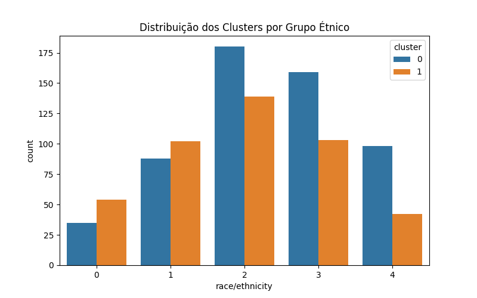

---
hide:
- toc
---

# 6. Comparação de Grupos

Nesta etapa, comparamos os clusters formados pelo K-means em relação a grupos étnicos e médias de notas dos estudantes.

=== "Código"
    ```python
    # Gráfico: Média de matemática por cluster
    fig, ax = plt.subplots(figsize=(8,5))
    sns.barplot(x='cluster', y='math score', data=df_encoded, ci=None, ax=ax)
    plt.title('Média de Matemática por Cluster')
    plt.savefig('imagens/barplot_cluster.png')
    plt.close()

    # Gráfico: Distribuição dos clusters por grupo étnico
    fig, ax = plt.subplots(figsize=(8,5))
    sns.countplot(x='race/ethnicity', hue='cluster', data=df_encoded, ax=ax)
    plt.title('Distribuição dos Clusters por Grupo Étnico')
    plt.savefig('imagens/barplot_cluster_etnia.png')
    plt.close()
    ```
=== "Resultado"
    
    

