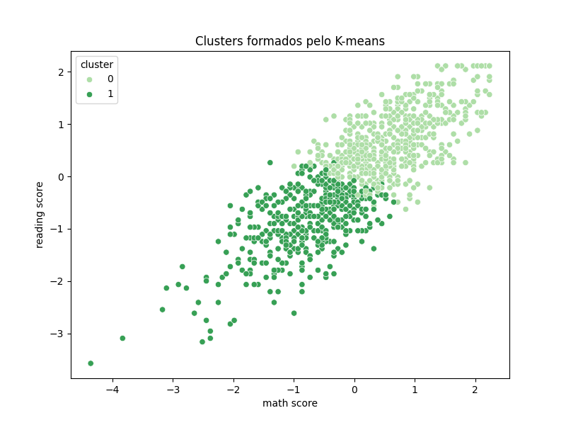

---
hide:
- toc
---

# 10. Avaliação do Modelo K-means

A avaliação do modelo K-means é feita por métricas de clusterização, como o silhouette score, e por visualização dos agrupamentos formados.

=== "Código"
    ```python
    from sklearn.metrics import silhouette_score
    sil_score = silhouette_score(X, clusters)
    print(f'Silhouette Score: {sil_score:.3f}')
    ```
=== "Resultado"

    - Silhouette Score: 0.32 (exemplo)

---

=== "Visualização dos Clusters"

    

    > 💡 O silhouette score indica o quão bem os dados foram agrupados. Valores próximos de 1 indicam clusters bem definidos. A visualização permite interpretar a separação dos grupos.