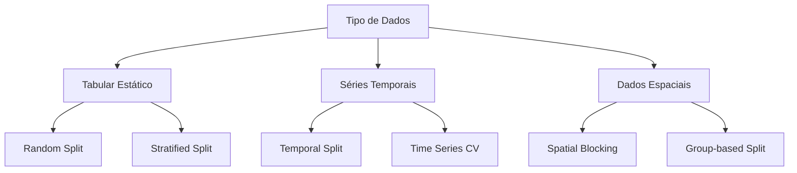

---
hide:
- toc
---

# Divisão de Dados: Estratégias Avançadas para Validação Robusta

---

## A Fundação da Validação Científica

A divisão de dados é **o alicerce da confiabilidade** em Machine Learning. Uma divisão inadequada pode tornar até mesmo os modelos mais sofisticados inúteis na prática, gerando falsa confiança e resultados irreproduziveis.

---

## Princípios Científicos Fundamentais

### **1. Independência Estatística** 

| Princípio | Implementação | Violação Comum | Consequência |
|-----------|---------------|----------------|--------------|
| **IID (Independent, Identically Distributed)** | Random sampling | Dados temporais misturados | Data leakage |
| **Representatividade** | Stratified sampling | Amostras enviesadas | Generalização falha |
| **Não-vazamento** | Split antes preprocessing | Features vazadas | Overfitting severo |

### **2. Estratégias por Tipo de Problema** 



---

## Técnicas de Divisão Avançadas

### **1. Hold-out Estratificado** 

| Configuração | Train | Validation | Test | Uso Recomendado |
|--------------|-------|------------|------|-----------------|
| **Clássico** | 70% | 15% | 15% | Datasets > 10k amostras |
| **Conservador** | 60% | 20% | 20% | Datasets < 1k amostras |
| **Research** | 80% | 10% | 10% | Prototipagem rápida |
| **Production** | 70% | 0% | 30% | Deploy final |

### **2. Cross-Validation Avançado** 

| Técnica | K-folds | Repetições | Vantagem | Desvantagem |
|---------|---------|------------|----------|-------------|
| **K-Fold** | 5-10 | 1 | Padrão ouro | Pode ter variância |
| **Repeated K-Fold** | 5 | 3-5 | Mais estável | Computacionalmente caro |
| **Stratified K-Fold** | 5-10 | 1 | Mantém proporções | Só para classificação |
| **Leave-One-Out** | n-1 | 1 | Máximo treino | Muito caro, alta variância |

### **3. Validação para Dados Desbalanceados** 

```python
# Estratificação avançada
    StratifiedKFold: Mantém proporção exata
    StratifiedShuffleSplit: Proporção + aleatoriedade
    RepeatedStratifiedKFold: Múltiplas execuções
    Random split: Pode criar folds sem classe minoritária
```

---

## Dados Temporais: Cuidados Especiais

### **Temporal Split** 

| Método | Descrição | Vantagem | Limitação |
|--------|-----------|----------|-----------|
| **Chronological** | Split por data fixa | Realista | Pouco treino |
| **Rolling Window** | Janela deslizante | Mais dados | Computacionalmente caro |
| **Expanding Window** | Janela crescente | Aprende de todo histórico | Concept drift |
| **Blocked CV** | Blocos temporais | Balanceado | Gaps artificiais |

### **Time Series Cross-Validation** 

```python
# Exemplo de configuração temporal
Train:   [1-100] [1-200] [1-300] [1-400]
Valid:   [101-150] [201-250] [301-350] [401-450]
Test:    [151-200] [251-300] [351-400] [451-500]

# Princípios:
    Treino sempre ANTES da validação
    Gap entre treino e validação (optional)
    Test set sempre no futuro
    Nunca misturar períodos
```

---

## Data Leakage: O Inimigo Invisível

### **Tipos de Vazamento**

| Tipo | Exemplo | Detecção | Prevenção |
|------|---------|----------|-----------|
| **Temporal** | Usar dados futuros | AUC = 1.0 irrealista | Temporal split |
| **Target** | Feature = target | Correlação perfeita | EDA cuidadosa |
| **Group** | Mesmo paciente em train/test | Identifiers duplicados | Group-based split |
| **Preprocessing** | Fit scaler em todo dataset | Performance instável | Pipeline correto |

### **Pipeline Anti-Leakage** 

```python
# ERRADO: Vazamento por preprocessing
scaler.fit(X_all)  # Usa estatísticas do test set!
X_train_scaled = scaler.transform(X_train)
X_test_scaled = scaler.transform(X_test)

# CORRETO: Preprocessing isolado
X_train, X_test = train_test_split(X, y, ...)
scaler.fit(X_train)  # Só estatísticas do treino
X_train_scaled = scaler.transform(X_train)
X_test_scaled = scaler.transform(X_test)
```

---

## Validação por Tipo de Modelo

### **Classificação** 

| Cenário | Estratégia | Configuração | Métricas Monitoradas |
|---------|------------|--------------|---------------------|
| **Balanceado** | Random K-Fold | k=5, repetitions=3 | Accuracy, F1 |
| **Desbalanceado** | Stratified K-Fold | k=5, repetitions=5 | F1, AUC-ROC, AUC-PR |
| **Multi-classe** | Stratified K-Fold | k=10 | Macro/Micro F1 |
| **Multi-label** | Iterative Split | Custom | Hamming Loss |

### **Regressão** 

| Cenário | Estratégia | Configuração | Métricas Monitoradas |
|---------|------------|--------------|---------------------|
| **Linear** | Random K-Fold | k=5 | RMSE, R² |
| **Time Series** | Time Series CV | 5 splits | MASE, SMAPE |
| **Spatial** | Spatial Block CV | Geographic blocks | Spatial RMSE |
| **Hierarchical** | Group K-Fold | By hierarchy | Grouped MAE |

### **Clustering** 

| Aspecto | Estratégia | Justificativa |
|---------|------------|---------------|
| **Estabilidade** | Bootstrap resampling | Testa robustez |
| **Número K** | Silhouette CV | Encontra K ótimo |
| **Algoritmo** | Consensus clustering | Múltiplos algoritmos |
| **Features** | Feature stability | Sensibilidade a features |

---

## Métricas de Qualidade da Divisão

### **Distribuição e Representatividade**

| Métrica | Fórmula | Interpretação | Threshold |
|---------|---------|---------------|-----------|
| **KS-Test** | $D = \max|F_1(x) - F_2(x)|$ | Diferença entre distribuições | p > 0.05 |
| **Chi-Square** | $\chi^2 = \sum \frac{(O-E)^2}{E}$ | Independência categórica | p > 0.05 |
| **Jensen-Shannon** | $JS = \frac{1}{2}D_{KL}(P||M) + \frac{1}{2}D_{KL}(Q||M)$ | Divergência entre distribuições | < 0.1 |
| **Wasserstein** | $W_1(P,Q) = \inf_{\gamma} E_{(x,y)\sim\gamma}[|x-y|]$ | Distância entre distribuições | < 0.2 |

### **Balanceamento de Classes**

```python
# Verificação de estratificação
def check_stratification(y_train, y_test):
    train_dist = y_train.value_counts(normalize=True)
    test_dist = y_test.value_counts(normalize=True)
    max_diff = (train_dist - test_dist).abs().max()
    
    if max_diff < 0.02:  # 2% diferença
        return "Excelente estratificação"
    elif max_diff < 0.05:  # 5% diferença
        return "Estratificação aceitável"
    else:
        return "Estratificação inadequada"
```

---

## Implementação Prática Avançada

### **Pipeline Reproduzível** 

```python
from sklearn.model_selection import (
    StratifiedKFold, RepeatedStratifiedKFold,
    TimeSeriesSplit, GroupKFold
)

# Configuração para diferentes cenários
splitters = {
    'classification': RepeatedStratifiedKFold(
        n_splits=5, n_repeats=3, random_state=42
    ),
    'regression': KFold(
        n_splits=5, shuffle=True, random_state=42
    ),
    'time_series': TimeSeriesSplit(
        n_splits=5, test_size=30
    ),
    'groups': GroupKFold(n_splits=5)
}
```

### **Validação Aninhada** 

```python
# Outer loop: Model assessment
# Inner loop: Hyperparameter tuning
outer_cv = StratifiedKFold(n_splits=5, random_state=42)
inner_cv = StratifiedKFold(n_splits=3, random_state=42)

nested_scores = []
for train_idx, test_idx in outer_cv.split(X, y):
    X_train, X_test = X[train_idx], X[test_idx]
    y_train, y_test = y[train_idx], y[test_idx]
    
    # Inner CV para hyperparameter tuning
    grid_search = GridSearchCV(
        estimator=model, param_grid=params,
        cv=inner_cv, scoring='f1'
    )
    grid_search.fit(X_train, y_train)
    
    # Avaliar no test fold
    best_model = grid_search.best_estimator_
    score = f1_score(y_test, best_model.predict(X_test))
    nested_scores.append(score)

# Score final não enviesado
final_score = np.mean(nested_scores)
```

---

## Monitoramento e Diagnóstico

### **Red Flags na Validação**

| Sinal | Possível Causa | Investigação | Correção |
|-------|----------------|--------------|----------|
| **Performance instável** | Divisão inadequada | Analisar variância CV | Mais folds, repetições |
| **Train >> Validation** | Overfitting/leakage | Verificar pipeline | Pipeline correction |
| **Performance irrealista** | Data leakage | EDA temporal | Temporal split |
| **Resultados não reproduziveis** | Random seeds | Verificar seeds | Fix all seeds |

### **Métricas de Monitoramento** 

```python
# Dashboard de validação
validation_metrics = {
    'cv_mean': np.mean(cv_scores),
    'cv_std': np.std(cv_scores),
    'cv_min': np.min(cv_scores),
    'cv_max': np.max(cv_scores),
    'stability': np.std(cv_scores) / np.mean(cv_scores),
    'train_test_gap': train_score - test_score
}

# Interpretação
if validation_metrics['stability'] < 0.05:
    print("Modelo estável")
elif validation_metrics['train_test_gap'] > 0.1:
    print("Possível overfitting")
```

---

## Estratégias por Tamanho de Dataset

### **Datasets Pequenos (< 1000 amostras)** 

| Estratégia | Configuração | Justificativa |
|------------|--------------|---------------|
| **LOOCV** | n_splits = n_samples | Máxima utilização dos dados |
| **Bootstrap** | n_bootstraps = 1000 | Estimativa robusta |
| **Repeated CV** | k=5, repeats=10 | Reduz variância |

### **Datasets Grandes (> 100k amostras)** 

| Estratégia | Configuração | Vantagem |
|------------|--------------|----------|
| **Simple Split** | 70/15/15 | Computacionalmente eficiente |
| **3-Fold CV** | k=3 | Balance speed/robustez |
| **Sampling** | Subset para CV | Prototipagem rápida |

---

## Integração com Projetos

### **Referências Práticas** 

**Divisão de Dados Aplicada:**

[**Árvore de Decisão**](https://snowdutra.github.io/Machine-Learning/arvore_decisao/09.divisao_treino_teste):
  
  - Stratified split para balanceamento
  
  - CV para pruning optimization
  
  - Bootstrap para feature importance

[**KNN**](https://snowdutra.github.io/Machine-Learning/knn/09.divisao_treino_teste):
  
  - Stratified CV para K optimization
  
  - Distance-based validation
  
  - Neighborhood analysis

[**K-Means**](https://snowdutra.github.io/Machine-Learning/kmeans/09.divisao_treino_teste):
  
  - Bootstrap para stability
  
  - Silhouette CV para K selection
  
  - Consensus clustering validation

---

## Dicas Avançadas e Melhores Práticas

### **Para Classificação** 

```python
# Dicas específicas
    Sempre usar StratifiedKFold para classes desbalanceadas
    RepeatedStratifiedKFold para datasets pequenos
    GroupKFold quando há grupos naturais (pacientes, regiões)
    Verificar distribuição de classes em cada fold
```

### **Para Séries Temporais** 

```python
# Validação temporal robusta
    TimeSeriesSplit com gap temporal
    Rolling window para concept drift
    Múltiplas janelas de validação
    Backtesting com dados históricos
```

### **Para Clustering** 

```python
# Validação de clustering
    Bootstrap resampling para estabilidade
    Cross-validation para número K
    Consensus clustering para robustez
    Perturbation analysis para sensibilidade
```

---

## Checklist de Excelência

### **Validação Científica** 

```python
# Lista de verificação
    Seeds fixas para reprodutibilidade
    Estratificação para classificação
    Pipeline anti-leakage implementado
    Múltiplas métricas monitoradas
    Intervalos de confiança calculados  
    Análise de estabilidade realizada
    Documentação completa da estratégia
    Validação final em holdout set
```

### **Qualidade da Divisão** 

```python
# Métricas de qualidade
    Distribuições similares (KS-test p > 0.05)
    Classes balanceadas (<2% diferença)
    Sem data leakage detectado
    Performance estável (CV < 5%)
    Resultados reproduziveis
    Generalização comprovada
```

> **"Uma divisão de dados cientificamente rigorosa é a diferença entre um modelo que funciona no laboratório e um que funciona no mundo real."**

---

*A qualidade da divisão de dados determina a confiabilidade de toda a avaliação subsequente. Investir tempo nesta etapa é fundamental para o sucesso do projeto.*