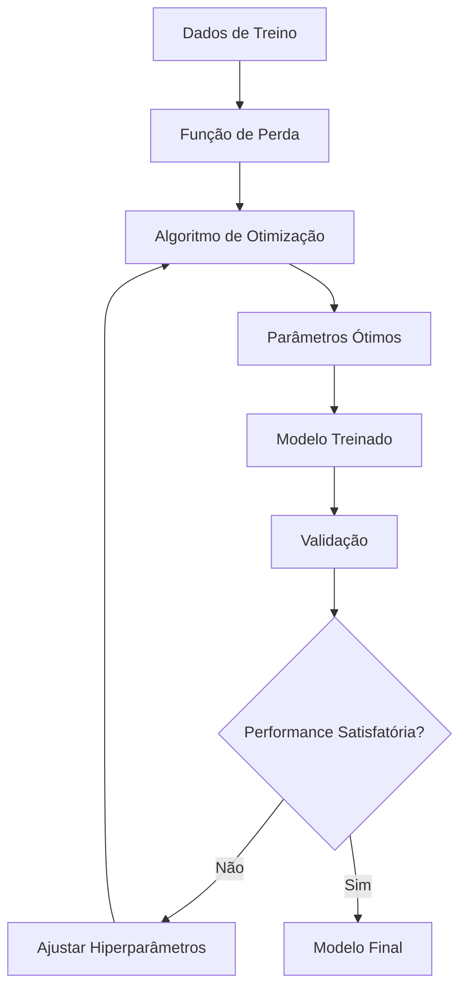

---
hide:
- toc
---

# Treinamento de Modelos: Metodologia Científica e Otimização Avançada

---

## Treinamento como Processo Científico

O treinamento de modelos de Machine Learning não é apenas "ajustar parâmetros" - é um **processo científico rigoroso** que combina teoria, experimentação e validação empírica para extrair conhecimento dos dados.

----

## Fundamentos Teóricos do Aprendizado

### **Teoria do Aprendizado Estatístico** 

| Conceito | Definição | Implicação Prática |
|----------|-----------|-------------------|
| **Bias-Variance Tradeoff** | $Error = Bias^2 + Variance + Noise$ | Balance complexidade vs generalização |
| **VC Dimension** | Capacidade de expressão do modelo | Escolha da complexidade adequada |
| **PAC Learning** | Probabilmente Aproximadamente Correto | Garantias teóricas de convergência |
| **No Free Lunch** | Nenhum algoritmo é universalmente superior | Necessidade de experimentação |

### **Processo de Otimização** 



---

## Hiperparâmetros: A Arte da Configuração

### **Categorização de Hiperparâmetros** 

| Categoria | Exemplos | Impacto | Estratégia de Busca |
|-----------|----------|---------|-------------------|
| **Arquiteturais** | K (KNN), n_clusters (K-Means) | Alto | Grid Search sistemático |
| **Regularização** | alpha, lambda | Médio-Alto | Log-uniform sampling |
| **Aprendizado** | learning_rate, momentum | Alto | Adaptive methods |
| **Processamento** | batch_size, n_jobs | Baixo-Médio | Heurísticas |

### **Espaço de Busca Inteligente** 

| Hiperparâmetro | Range Típico | Distribuição | Justificativa |
|----------------|--------------|--------------|---------------|
| **K (KNN)** | [1, √n] | Linear | Evitar underfitting/overfitting |
| **Learning Rate** | [1e-5, 1e-1] | Log-uniform | Ordens de magnitude |
| **Regularização** | [1e-6, 1e1] | Log-uniform | Amplo espectro |
| **N_estimators** | [10, 1000] | Linear/Log | Balance performance/cost |


---

## Treinamento por Tipo de Algoritmo

### **K-Nearest Neighbors (KNN)** 

#### **Parâmetros Críticos** 

| Parâmetro | Opções | Impacto na Performance | Estratégia |
|-----------|--------|----------------------|------------|
| **n_neighbors** | 1, 3, 5, 7, 9, 11, 15 | 🔴 Crítico | Odd numbers, √n rule |
| **weights** | uniform, distance | 🟡 Moderado | Distance para dados ruidosos |
| **metric** | euclidean, manhattan, minkowski | 🟡 Moderado | Euclidean padrão, manhattan para alta dimensão |
| **p** | 1 (manhattan), 2 (euclidean) | 🟢 Baixo | Combinar com metric |

#### **Processo de Otimização**

```python
# Pipeline de treinamento KNN
1.    Análise exploratória das distâncias
2.    Normalização/padronização obrigatória  
3.    Grid search para K ótimo
4.    Validação cruzada estratificada
5.    Análise de vizinhança local
6.    Otimização para produção (indexing)
```

#### **Diagnóstico de Performance** 

| K Muito Baixo (K=1) | K Muito Alto (K=n/2) | K Ótimo |
|---------------------|---------------------|---------|
| 🔴 Alto overfitting | 🔴 Alto underfitting | 🟢 Balance ideal |
| 🔴 Sensível a ruído | 🔴 Perde detalhes | 🟢 Generaliza bem |
| 🔴 Decisões erráticas | 🔴 Sempre classe majoritária | 🟢 Decisões estáveis |

### **K-Means Clustering** 

#### **Parâmetros Fundamentais** 

| Parâmetro | Opções | Impacto | Otimização |
|-----------|--------|---------|------------|
| **n_clusters** | 2-10 (típico) | 🔴 Crítico | Elbow + Silhouette |
| **init** | k-means++, random | 🟡 Moderado | k-means++ mais estável |
| **n_init** | 10-50 | 🟡 Moderado | Mais para dados ruidosos |
| **max_iter** | 100-1000 | 🟢 Baixo | Monitorar convergência |

#### **Métodos de Otimização do K** 

```python
# Consenso científico para K ótimo
Métodos:           Resultado:
1. Elbow Method    → K = 3
2. Silhouette      → K = 3  
3. Calinski-H      → K = 3
4. Davies-Bouldin  → K = 3
-----------------------
Consenso: K = 3 
```

#### **Processo de Convergência** 

| Iteração | Movimento Centroides | Inércia | Status |
|----------|---------------------|---------|--------|
| 1 | Grande | 1000.5 | Inicializando |
| 5 | Moderado | 456.2 | Convergindo |
| 10 | Pequeno | 245.8 | Quase estável |
| 15 | < 0.001 | 245.6 | Convergido |

---

## Estratégias de Otimização Avançadas

### **Grid Search vs Random Search** 

| Método | Vantagens | Desvantagens | Quando Usar |
|--------|-----------|--------------|-------------|
| **Grid Search** | Sistemático, reproduzível | Explosão combinatorial | Poucos hiperparâmetros |
| **Random Search** | Eficiente, explora bem | Pode perder ótimo global | Muitos hiperparâmetros |
| **Bayesian Optimization** | Inteligente, sample-efficient | Complexo, overhead | Avaliação custosa |
| **Halving Search** | Rápido, escalável | Pode eliminar bons candidatos | Recursos limitados |

### **Pipeline de Otimização Sistemática** 

```python
# Estágio 1: Busca grosseira
coarse_grid = {
    'n_neighbors': [3, 7, 11, 15],
    'weights': ['uniform', 'distance'],
    'metric': ['euclidean', 'manhattan']
}

# Estágio 2: Refinamento
fine_grid = {
    'n_neighbors': [5, 6, 7, 8, 9],  # Ao redor do melhor
    'weights': ['distance'],          # Melhor do estágio 1
    'metric': ['manhattan']           # Melhor do estágio 1
}

# Estágio 3: Fine-tuning
final_grid = {
    'n_neighbors': [6, 7, 8],        # Refinamento final
    'p': [1, 1.5, 2]                 # Minkowski parameter
}
```

---

## Monitoramento e Diagnóstico

### **Métricas de Treinamento** 

| Métrica | Fórmula | Interpretação | Ação |
|---------|---------|---------------|------|
| **Training Error** | $\frac{1}{n}\sum L(y_i, \hat{y}_i)$ | Error nos dados de treino | Se alto: modelo muito simples |
| **Validation Error** | $\frac{1}{m}\sum L(y_j, \hat{y}_j)$ | Error em dados não vistos | Se alto vs train: overfitting |
| **Generalization Gap** | $Error_{val} - Error_{train}$ | Capacidade de generalizar | Gap > 0.1: problema |
| **Learning Curve** | Error vs dataset size | Comportamento assintótico | Diagnóstico de capacidade |

### **Curvas de Aprendizagem** 

```python
# Interpretação das curvas
    Gap alto e persistente → Overfitting
    Ambas curvas altas → Underfitting  
    Convergência rápida → Modelo adequado
    Instabilidade → Dados insuficientes
```

### **Validação de Convergência** 

| Algoritmo | Critério de Parada | Tolerância | Monitoramento |
|-----------|-------------------|------------|---------------|
| **KNN** | N/A (não iterativo) | - | Estabilidade CV |
| **K-Means** | Movimento centroides | 1e-4 | Inércia por iteração |
| **Gradient Descent** | Gradiente norma | 1e-6 | Loss function |
| **EM** | Log-likelihood | 1e-5 | Probability improvement |


---

## Otimizações para Produção

### **Eficiência Computacional**

| Técnica | Aplicação | Speedup | Trade-off |
|---------|-----------|---------|-----------|
| **Approximation** | KNN com LSH | 10-100x | Pequena perda accuracy |
| **Indexing** | KNN com KD-Tree | 2-5x | Curse of dimensionality |
| **Parallelização** | K-Means distribuído | n_cores x | Overhead comunicação |
| **Early Stopping** | Iterative algorithms | 2-3x | Pode parar antes ótimo |

### **Estratégias de Memória** 

```python
# Otimizações de memória
    Mini-batch processing para datasets grandes
    Feature selection para reduzir dimensionalidade  
    Sparse matrices para dados esparsos
    Memory mapping para datasets que não cabem na RAM
    Incremental learning quando possível
```


---

## Treinamento Específico por Problema

### **Classificação Desbalanceada**

| Técnica | Implementação | Quando Usar |
|---------|---------------|-------------|
| **Class Weights** | `class_weight='balanced'` | Desbalanceamento moderado |
| **SMOTE** | Synthetic oversampling | Poucos dados classe minoritária |
| **Cost-sensitive** | Custom loss function | Custos assimétricos |
| **Ensemble** | Balanced bagging | Desbalanceamento severo |

### **Dados de Alta Dimensionalidade** 

| Problema | Solução | Implementação |
|----------|---------|---------------|
| **Curse of Dimensionality** | Dimensionality reduction | PCA, t-SNE |
| **Feature Selection** | Univariate selection | SelectKBest |
| **Regularization** | L1/L2 penalties | Regularized models |
| **Distance Metrics** | Cosine, Jaccard | Custom metrics |

---

## Validação e Teste

### **Protocolo de Validação Rigorosa**

```python
# Protocolo científico
1.    Split inicial dos dados (antes de qualquer análise)
2.    EDA apenas nos dados de treino
3.    Preprocessing fitted apenas no treino
4.    Hyperparameter tuning com CV no treino
5.    Modelo final treinado em treino+validação
6.    Avaliação final apenas no test set
7.    Estatísticas de significância reportadas
```

### **Testes de Hipóteses** 

| Teste | Hipótese | Estatística | Interpretação |
|-------|----------|-------------|---------------|
| **McNemar** | Modelos diferentes | $\chi^2$ | Diferença significativa |
| **Paired t-test** | CV scores | t-statistic | Melhoria significativa |
| **Wilcoxon** | Distribuições não-normais | W-statistic | Diferença robusta |
| **Bootstrap** | Intervalos de confiança | Percentis | Incerteza da métrica |

---

## Boas Práticas e Padrões

### **Reprodutibilidade** 

```python
# Checklist de reprodutibilidade
    Seeds fixas para todos os componentes aleatórios
    Versões de bibliotecas documentadas  
    Hardware/OS documentado
    Pipeline completo versionado
    Dados de entrada hasheados
    Configurações em arquivos separados
```

### **Documentação do Treinamento**

| Aspecto | Informação | Importância |
|---------|------------|-------------|
| **Configuração** | Hiperparâmetros, seeds | Reprodutibilidade |
| **Performance** | Métricas, intervalos confiança | Validação |
| **Tempo** | Training time, convergência | Eficiência |
| **Recursos** | RAM, CPU utilização | Escalabilidade |
| **Experimentos** | Tentativas, failures | Aprendizado |

---

## Integração com Projetos

### **Referências Práticas** 

**Treinamento de Modelos Aplicado:**

[**Árvore de Decisão**](https://snowdutra.github.io/Machine-Learning/arvore_decisao/10.treinamento_modelo):
  
  - Pruning para evitar overfitting
  
  - Critérios de split optimization
  
  - Ensemble methods

[**KNN**](https://snowdutra.github.io/Machine-Learning/knn/10.treinamento_modelo):
  
  - Otimização sistemática de K
  
  - Distance metrics optimization
  
  - Neighborhood analysis

[**K-Means**](https://snowdutra.github.io/Machine-Learning/kmeans/10.treinamento_modelo):
  
  - Convergência analysis
  
  - Multiple initializations
  
  - Stability assessment

---

## Insights Avançados

### **Diagnóstico de Problemas Comuns** 

| Sintoma | Possível Causa | Investigação | Solução |
|---------|----------------|--------------|---------|
| **High bias** | Modelo muito simples | Learning curves | Modelo mais complexo |
| **High variance** | Modelo muito complexo | CV instável | Regularização, mais dados |
| **Poor convergence** | Hiperparâmetros ruins | Monitorar loss | Grid search |
| **Inconsistent results** | Seeds não fixas | Reproducibility check | Fix random seeds |

### **Otimização Automática** 

```python
# AutoML pipeline
    Automated feature engineering
    Hyperparameter optimization
    Model selection
    Ensemble methods
    Performance monitoring
    Deployment pipeline
```

> **"O treinamento de modelos é onde a ciência encontra a arte - uma combinação de rigor metodológico e intuição experimental que transforma dados em conhecimento acionável."**

---

*O sucesso no treinamento de modelos reside na combinação de fundamentação teórica sólida, experimentação sistemática e validação rigorosa dos resultados.*