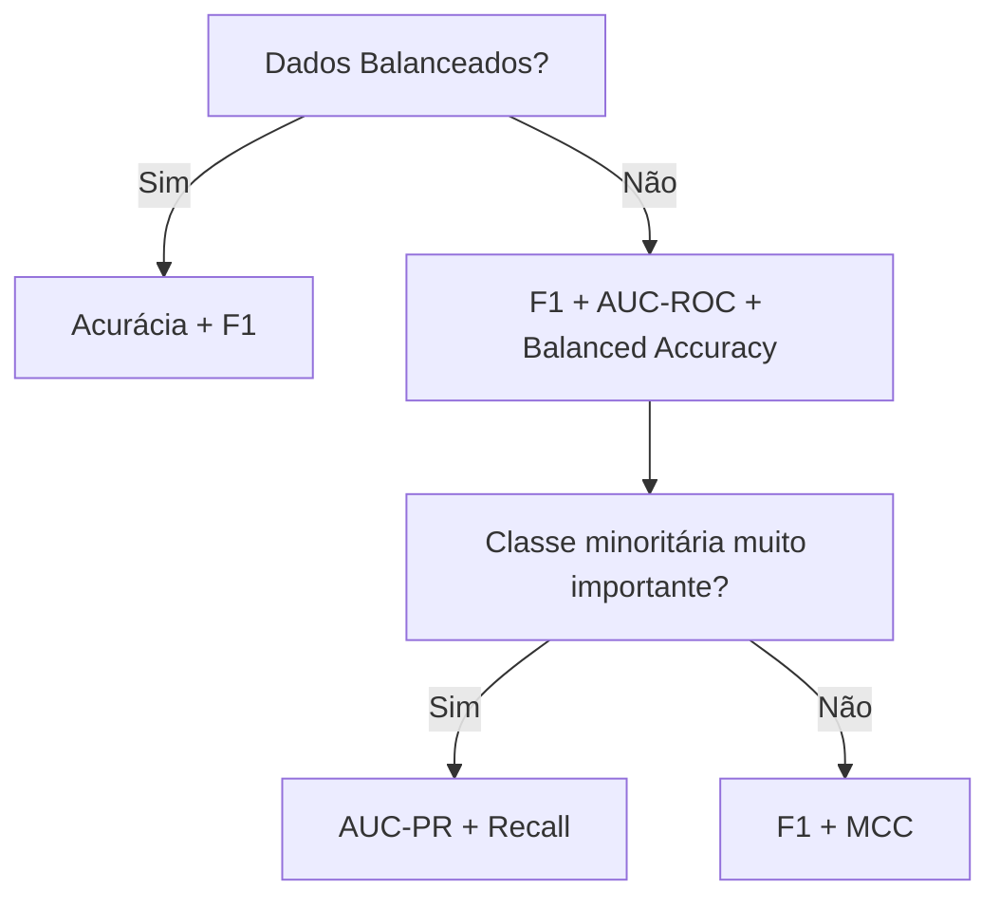
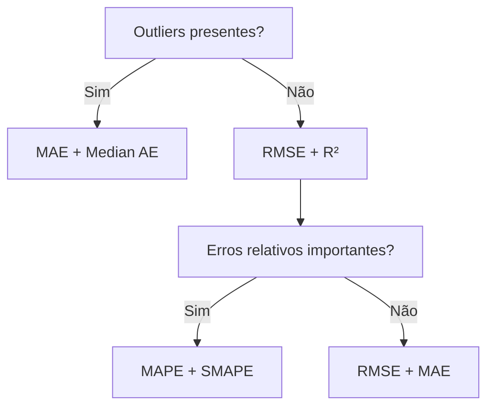
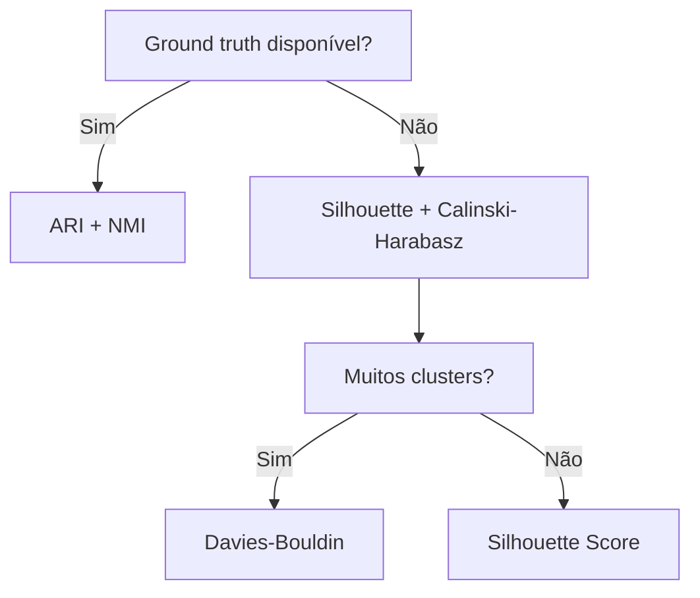

---
hide:
- toc
---

# 02. Métricas de Avaliação Avançadas

## 🎯 Classificação: Métricas Fundamentais e Avançadas

### **Métricas Básicas** 📊

| Métrica | Propósito | Fórmula | Quando Usar | Limitações |
|---------|-----------|---------|-------------|------------|
| **Acurácia** | Proporção geral de acertos | $\frac{TP + TN}{TP + TN + FP + FN}$ | Dados balanceados | Falha com desbalanceamento |
| **Precisão** | Confiabilidade dos positivos | $\frac{TP}{TP + FP}$ | Falsos positivos custosos | Ignora falsos negativos |
| **Recall (Sensibilidade)** | Cobertura dos positivos | $\frac{TP}{TP + FN}$ | Falsos negativos críticos | Ignora falsos positivos |
| **F1-Score** | Harmonia Precisão-Recall | $2 \cdot \frac{P \times R}{P + R}$ | Dados desbalanceados | Média pode mascarar extremos |

### **Métricas Robustas para Dados Desbalanceados** 🎭

| Métrica | Fórmula | Interpretação | Vantagens |
|---------|---------|---------------|-----------|
| **Balanced Accuracy** | $\frac{1}{2}(\frac{TP}{TP+FN} + \frac{TN}{TN+FP})$ | Média dos recalls por classe | Não enviesada por distribuição |
| **Matthews Correlation** | $\frac{TP \times TN - FP \times FN}{\sqrt{(TP+FP)(TP+FN)(TN+FP)(TN+FN)}}$ | Correlação entre predição e realidade [-1,1] | Considera todas as células da matriz |
| **Cohen's Kappa** | $\frac{p_o - p_e}{1 - p_e}$ | Concordância além do acaso | Ajusta para concordância aleatória |
| **AUC-ROC** | Área sob curva ROC | Discriminação entre classes [0,1] | Independente do threshold |
| **AUC-PR** | Área sob curva Precision-Recall | Performance em classe minoritária | Melhor para dados muito desbalanceados |

### **Métricas de Calibração** 🎯

| Métrica | Propósito | Interpretação |
|---------|-----------|---------------|
| **Brier Score** | Acurácia das probabilidades | Menor é melhor [0,1] |
| **Log Loss** | Penaliza predições confiantes incorretas | Menor é melhor |
| **Reliability Diagram** | Visualiza calibração | Diagonal = perfeitamente calibrado |

## 📈 Regressão: Do Básico ao Avançado

### **Métricas Fundamentais** 📊

| Métrica | Fórmula | Unidade | Robustez a Outliers | Interpretabilidade |
|---------|---------|---------|---------------------|-------------------|
| **MAE** | $\frac{1}{n}\sum_{i=1}^n |y_i - \hat{y}_i|$ | Original | Alta | Excelente |
| **MSE** | $\frac{1}{n}\sum_{i=1}^n (y_i - \hat{y}_i)^2$ | Quadrática | Baixa | Moderada |
| **RMSE** | $\sqrt{MSE}$ | Original | Baixa | Boa |
| **MAPE** | $\frac{100\%}{n}\sum_{i=1}^n \left|\frac{y_i - \hat{y}_i}{y_i}\right|$ | Percentual | Moderada | Excelente |

### **Métricas de Ajuste** 🎯

| Métrica | Fórmula | Interpretação | Limitações |
|---------|---------|---------------|------------|
| **R² (Coef. Determinação)** | $1 - \frac{SS_{res}}{SS_{tot}}$ | % variância explicada | Sempre aumenta com mais features |
| **R² Ajustado** | $1 - \frac{(1-R^2)(n-1)}{n-k-1}$ | Penaliza complexidade | Melhor para comparar modelos |
| **AIC (Critério Akaike)** | $2k - 2\ln(L)$ | Balança ajuste vs complexidade | Requer likelihood |
| **BIC (Critério Bayesiano)** | $k\ln(n) - 2\ln(L)$ | Penaliza mais a complexidade | Favorece modelos simples |

### **Métricas Robustas** 💪

| Métrica | Fórmula | Vantagem |
|---------|---------|----------|
| **Median AE** | $\text{mediana}(|y_i - \hat{y}_i|)$ | Imune a outliers extremos |
| **Huber Loss** | $\begin{cases} \frac{1}{2}(y-\hat{y})^2 & \text{se } |y-\hat{y}| \leq \delta \\ \delta|y-\hat{y}| - \frac{1}{2}\delta^2 & \text{caso contrário} \end{cases}$ | Combina MSE e MAE |

## 🎭 Clustering: Métricas Internas e Externas

### **Métricas Internas** (Sem ground truth) 🔍

| Métrica | Fórmula/Conceito | Interpretação | Range |
|---------|------------------|---------------|-------|
| **Silhouette Score** | $\frac{b-a}{\max(a,b)}$ onde $a$ = dist. intra-cluster, $b$ = dist. inter-cluster | Qualidade da separação | [-1, 1] |
| **Calinski-Harabasz** | $\frac{SS_B/(k-1)}{SS_W/(n-k)}$ | Razão variância entre/dentro clusters | [0, ∞] |
| **Davies-Bouldin** | $\frac{1}{k}\sum_{i=1}^k \max_{j \neq i} \frac{\sigma_i + \sigma_j}{d(c_i, c_j)}$ | Similaridade média entre clusters | [0, ∞] |
| **Inércia (WCSS)** | $\sum_{i=1}^k \sum_{x \in C_i} ||x - \mu_i||^2$ | Compactação dos clusters | [0, ∞] |

### **Métricas Externas** (Com ground truth) ✅

| Métrica | Interpretação | Vantagem |
|---------|---------------|----------|
| **Adjusted Rand Index** | Similaridade corrigida por acaso | Ajustada para chance |
| **Normalized Mutual Information** | Informação compartilhada normalizada | Teóricamente fundamentada |
| **Homogeneity** | Clusters contêm apenas uma classe | Penaliza mistura |
| **Completeness** | Membros de uma classe em mesmo cluster | Penaliza divisão |

## 🎮 Métricas Especializadas por Domínio

### **Sistemas de Recomendação** 🎬

| Métrica | Propósito | Fórmula |
|---------|-----------|---------|
| **Precision@K** | Relevância nos top-K | $\frac{\text{Relevantes em top-K}}{K}$ |
| **Recall@K** | Cobertura nos top-K | $\frac{\text{Relevantes em top-K}}{\text{Total Relevantes}}$ |
| **NDCG** | Ranking com posição | $\frac{DCG@K}{IDCG@K}$ |
| **MAP** | Precisão média | $\frac{1}{Q}\sum_{q=1}^Q AP(q)$ |

### **Séries Temporais** ⏰

| Métrica | Característica | Uso |
|---------|----------------|-----|
| **SMAPE** | Simétrica e percentual | Comparar séries diferentes |
| **MASE** | Escala absoluta | Benchmark contra naive |
| **Theil's U** | Relativa ao random walk | Avaliação econômica |

### **Modelos Probabilísticos** 🎲

| Métrica | Propósito | Interpretação |
|---------|-----------|---------------|
| **Perplexidade** | Qualidade de modelo de linguagem | Menor = melhor |
| **Entropia Cruzada** | Divergência entre distribuições | Menor = melhor |
| **KL-Divergência** | Diferença entre distribuições | 0 = idênticas |

## 🎯 Guia de Seleção de Métricas

### **Para Classificação** 📊

### **Para Regressão** 📈

### **Para Clustering** 🎭

## 🚨 Armadilhas Comuns

### **❌ Uso Incorreto**
- Acurácia em dados 99% desbalanceados
- R² sem considerar overfitting
- Silhouette Score com apenas 2 clusters

### **✅ Melhores Práticas**
- **Múltiplas métricas** complementares
- **Intervalos de confiança** nas métricas
- **Análise residual** em regressão
- **Validação cruzada** para robustez

## 🎓 Interpretação Prática

### **Classificação - Benchmarks** 🎯
- **Excelente**: AUC-ROC > 0.9, F1 > 0.8
- **Bom**: AUC-ROC > 0.8, F1 > 0.7
- **Moderado**: AUC-ROC > 0.7, F1 > 0.6
- **Ruim**: AUC-ROC < 0.6, F1 < 0.5

### **Clustering - Benchmarks** 🎭
- **Excelente**: Silhouette > 0.7
- **Bom**: Silhouette > 0.5
- **Moderado**: Silhouette > 0.3
- **Ruim**: Silhouette < 0.2

> **"A métrica perfeita não existe. A combinação inteligente de múltiplas métricas revela a verdade sobre o modelo."**