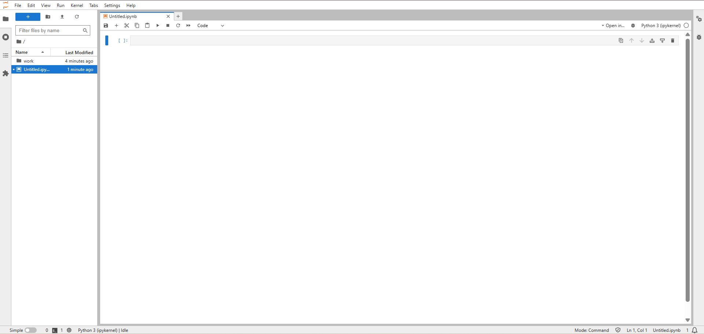
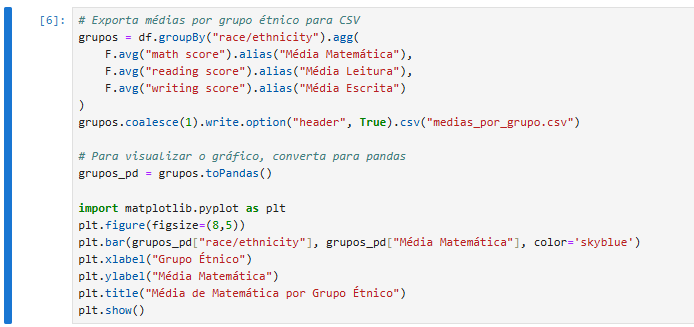

---
hide:
- toc
---

# Relatório PySpark - Cluster com Docker Compose

## 1. Configuração do Ambiente
- O cluster Spark foi configurado com Docker Compose, incluindo Spark Master, Spark Worker e Jupyter Notebook.
- As interfaces web do Spark Master, Worker e Jupyter foram acessadas e validadas.

### Interface do Spark Master

---

### Interface do Spark Worker

---

### Interface do Jupyter Notebook

---

## 2. Execução de Scripts PySpark
- O arquivo `StudentsPerformance.csv` foi utilizado para análise de dados.
- Foram realizadas operações de leitura, agregação, estatísticas e exportação de resultados.
- Gráficos foram gerados para visualização das médias de matemática por grupo étnico.

### Código 01

### Resultado 01

---

### Código 02

### Resultado 02

---

### Código 03

### Resultado 03

---

### Código 04

### Resultado 04

---

## 3. Principais Resultados
- Médias das notas por gênero e grupo étnico calculadas com PySpark.
- Contagem de alunos por grupo étnico.
- Exportação dos resultados para CSV.
- Visualização gráfica das médias por grupo étnico.

## 4. Desafios e Soluções
- Ajuste das imagens Docker para garantir o funcionamento das interfaces web.
- Configuração correta do ambiente para rodar PySpark no Jupyter Notebook do container.

## 5. Aprendizados
- Experiência prática com cluster Spark em ambiente Docker.
- Integração entre PySpark, Jupyter e análise de dados reais.
- Exportação e visualização de resultados para portfólio.

---