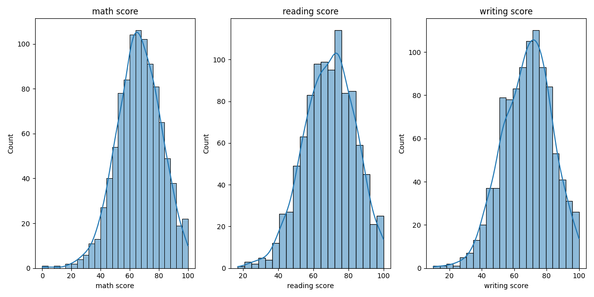

# 05. Visualização das Notas

São criados gráficos para visualizar a distribuição das notas de matemática, leitura e escrita. Essa etapa facilita a identificação de padrões e possíveis assimetrias nas variáveis alvo.

---

**Código utilizado:**
```python
plt.figure(figsize=(12,6))
for i, col in ["math score", "reading score", "writing score"]:
    plt.subplot(1, 3, i+1)
    sns.histplot(df[col], kde=True)
    plt.title(col)
plt.tight_layout()
plt.show()
```

**Resultado esperado:**
- Três gráficos de histograma, um para cada nota (matemática, leitura e escrita), mostrando a distribuição dos alunos em cada disciplina.
- É possível observar se há assimetria, concentração ou dispersão nas notas, além de identificar possíveis outliers.

---

**Complemento:**
O gráfico abaixo mostra que as distribuições das notas são aproximadamente normais, com leve assimetria. A maioria dos alunos tem notas entre 50 e 80. Não há grandes concentrações de outliers.

