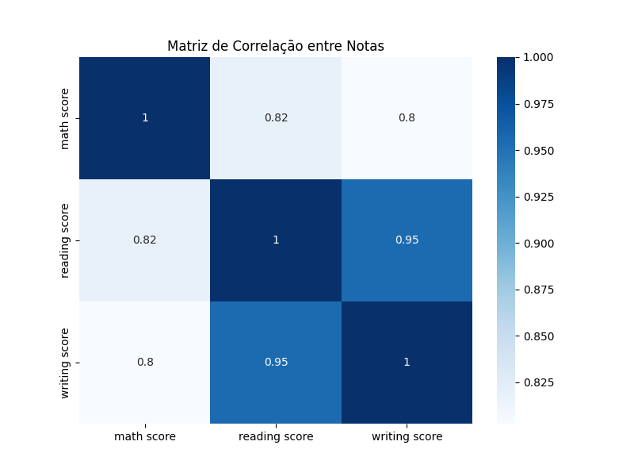

# 06. Correlação entre Variáveis

Nesta etapa, é analisada a correlação entre as notas e outras variáveis do dataset. O objetivo é identificar relações importantes que podem influenciar o desempenho dos alunos.

---

**Código utilizado:**
```python
plt.figure(figsize=(8,6))
sns.heatmap(df[["math score", "reading score", "writing score"]].corr(), annot=True, cmap='Blues')
plt.title('Matriz de Correlação entre Notas')
plt.show()
```

---

**Complemento:**
O gráfico abaixo mostra a matriz de correlação:
- math score x reading score: 0.82
- math score x writing score: 0.80
- reading score x writing score: 0.95

**Explicação:**
As notas de leitura e escrita são fortemente correlacionadas, indicando que alunos que vão bem em uma dessas disciplinas tendem a ir bem na outra.

