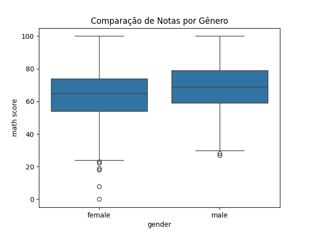

# Comparação de Grupos

Aqui são comparados grupos de alunos, como por gênero, tipo de preparação ou grupo étnico, utilizando gráficos e estatísticas para identificar diferenças de desempenho.

---

**Código utilizado:**
```python
sns.boxplot(x='gender', y='math score', data=df)
plt.title('Comparação de Notas por Gênero')
plt.savefig('imagens/comparacao_grupos.png')
plt.show()
```
---

**Complemento:**
O boxplot abaixo mostra que meninas têm desempenho ligeiramente superior em matemática. A diferença entre gêneros é pequena, mas perceptível. Outros grupos (preparação, etnia) podem ser analisados de forma semelhante para identificar padrões de desempenho.

