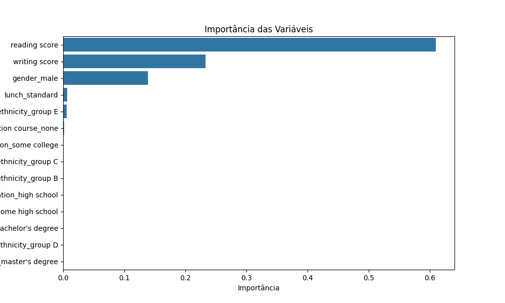

# 11. Avaliação do Modelo

O desempenho do modelo é avaliado utilizando métricas como MSE e R², além da análise da importância das variáveis para a predição das notas.

---

**Código utilizado:**
```python
from sklearn.metrics import mean_squared_error, r2_score
y_pred = rf.predict(X_test)
print('MSE:', mean_squared_error(y_test, y_pred))
print('R²:', r2_score(y_test, y_pred))
importances = rf.feature_importances_
feat_names = X.columns
feat_imp = pd.Series(importances, index=feat_names).sort_values(ascending=False)
plt.figure(figsize=(10,6))
sns.barplot(x=feat_imp, y=feat_imp.index)
plt.title('Importância das Variáveis')
plt.xlabel('Importância')
plt.ylabel('Variável')
plt.savefig('imagens/importancia_variaveis.png')
plt.show()
```

---

**Complemento:**
Arquivo `avaliacao_modelo.txt` contém:
- MSE: 0.00347
- R²: 0.8575

O gráfico abaixo mostra que as variáveis mais importantes para prever a nota de matemática são: reading score, writing score e gênero masculino.



**Explicação:**
O modelo apresenta bom desempenho (R² alto). As variáveis de leitura e escrita são as mais relevantes para a predição da nota de matemática.